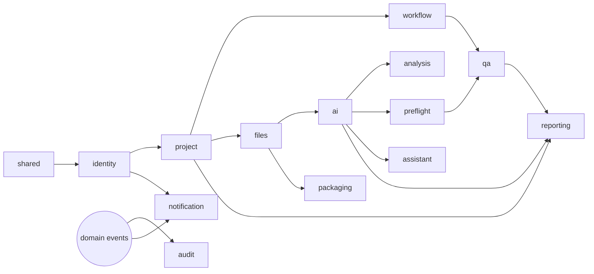

# Protrack — Phase 1 MVP · Implementation Roadmap

> Source of truth: the six approved architecture docs in `docs/architecture/`. No redesign.
> No implementation code until the roadmap is approved. Then we build sprint by sprint.

---

## 1. Git repository structure (recommended: monorepo)

A single monorepo holds all three deployables + infra + docs. Rationale: one source of truth, atomic cross-cutting changes (e.g. an API contract change touches web + api together), shared CI, simpler onboarding for a small team. Each app still deploys independently (path-filtered CI).

```
protrack/
├── apps/
│   ├── web/                     # React 19 + TS + Vite + MUI        → Vercel
│   ├── api/                     # Spring Boot 3 (Java 21, modular)  → Render
│   └── ai/                      # FastAPI (Python 3.12)             → Render
├── packages/
│   └── api-contract/            # OpenAPI spec + generated TS types (shared web↔api)
├── infra/
│   ├── docker-compose.yml       # local: postgres + api + ai (+ web optional)
│   ├── render/                  # render.yaml service blueprints
│   └── env/                     # .env.example per app (no secrets)
├── docs/
│   ├── architecture/            # the 6 approved docs (frozen source of truth)
│   └── IMPLEMENTATION_ROADMAP.md
├── .github/workflows/           # ci-web.yml, ci-api.yml, ci-ai.yml, ci-contract.yml
├── .gitignore  README.md  CODEOWNERS  CONTRIBUTING.md
```

Per-app internal structure follows exactly the package/folder trees in the Backend, Frontend, and AI Service architecture docs.

---

## 2. Development workflow

- **Branching — trunk-based with short-lived feature branches.** `main` is always deployable and protected (PR + green CI + 1 review required, no direct push). Branch names: `feat/<sprint>-<slug>`, `fix/<slug>`, `chore/<slug>`.
- **Commits — Conventional Commits** (`feat:`, `fix:`, `chore:`, `docs:`, `test:`, `refactor:`), scoped where useful (`feat(api/identity): ...`). Enables changelog + signals intent.
- **PRs** small and sprint-scoped; description links the sprint + DoD checklist; CI must pass; preview deploy (Vercel) attached for UI PRs.
- **CI (GitHub Actions, path-filtered):** `web` → typecheck + lint + Vitest + build; `api` → Gradle build + JUnit + Testcontainers; `ai` → ruff + mypy + pytest; `contract` → OpenAPI lint + type-gen drift check. Merge blocked on failure.
- **Testing layers:** unit (Vitest/JUnit/pytest) → integration (Testcontainers Postgres for api; httpx for ai) → contract (OpenAPI ↔ generated types) → E2E (Playwright against the deployed/local stack, added from Sprint 2 onward).
- **Environments:** `local` (docker-compose) → `prod` (Vercel + Render + Neon). Secrets via platform env vars only. Flyway migrations run on api boot.
- **Versioning/tags:** tag a release at each sprint's DoD (`v0.1.0` … ) for traceability.

---

## 3. Module dependency graph & implementation order



**Build order (respects dependencies):**
`shared/infra → identity → project → workflow → (audit cross-cuts) → files → packaging → ai(+FastAPI) → analysis → preflight → qa → notification → assistant → reporting → hardening/deploy`.

This is sequenced into the sprints below. Each sprint is a **vertical slice** (DB → backend → AI if needed → frontend → tests) so something demoable exists at every step.

---

## 4. Sprints

> Every sprint shares this **baseline Definition of Done**: code reviewed + merged to `main`; unit/integration tests passing in CI; lint/typecheck/format clean; no secrets committed; relevant docs/README updated; the slice runs locally via docker-compose and (from Sprint 1) is deployed; traceability to the architecture docs noted in the PR.

---

### Sprint 0 — Foundations, Repo & Deployment Skeleton
**Objectives:** stand up the monorepo, three runnable empty apps, local + cloud plumbing, CI/CD, DB connectivity — a "walking skeleton."
**Deliverables:** repo scaffold; `docker-compose` (Postgres + api + ai); Vercel/Render/Neon projects wired; CI green on all three; health checks live in prod; the MUI app shell renders an empty themed page.
**Files/folders:** the full `protrack/` tree (apps scaffolded, `infra/`, `.github/workflows/`, `packages/api-contract/`, `docs/`).
**Backend:** Spring Boot project (Java 21, Gradle), `shared` package skeleton (config, error handler, properties, health), Flyway wired to Neon, Actuator health, OpenAPI (springdoc) enabled, profiles `local/prod`.
**Frontend:** Vite + React 19 + TS + MUI; `AppProviders`, theme from design tokens, router with `/login` + `/dashboard` placeholders, Axios instance skeleton, env config.
**AI service:** FastAPI app, `core/config`, `core/security` (internal-key dependency stub), `/internal/v1/health` + `/ready`, structlog setup, Dockerfile.
**Database:** Neon project + `local` DB; Flyway baseline migration `V1__baseline.sql` (extensions, schema, empty); confirm connectivity.
**Testing:** CI pipelines (web/api/ai/contract); one smoke test per app; health endpoints asserted.
**DoD:** all three apps deploy and return healthy; CI green; `docker-compose up` runs the stack locally; themed empty shell visible.

---

### Sprint 1 — Identity, Auth & App Shell (RBAC foundation)
**Objectives:** real authentication + RBAC + the role-shaped shell. Depends on: Sprint 0.
**Deliverables:** login works end-to-end; JWT + refresh; seeded users for the 4 roles; protected, role-shaped navigation; `/me` drives the UI.
**Files/folders:** api `identity/*` + `shared/security/*`; web `features/auth/*`, `components/layout/*` (AppShell, Sidebar, TopBar, RoleSwitcher), `app/router/{ProtectedRoute,RoleRoute}`.
**Backend:** `User/Role/Permission/RefreshToken` entities + repos; `AuthService`, `TokenService`, `UserService`; `JwtAuthenticationFilter`, `SecurityConfig` (path rules), method-security setup, `ProtrackUserDetailsService`, BCrypt; `AuthController` (`login/refresh/logout/forgot/reset`), `UserController`, `RoleController`; `/me` (profile + roles + permissions + nav model); `IdentityFacade`.
**Frontend:** `AuthContext`, `LoginPage`/`LoginForm` (RHF+Zod), Axios auth + refresh interceptors, `ProtectedRoute`/`RoleRoute`, `AppShell` with role-driven `navConfig`, `RoleSwitcher` (demo client toggle), `useCan`/`<Can>`.
**Database:** `V2__identity.sql` (organizations, users, roles, user_roles, permissions, role_permissions, refresh_tokens); seed one org + 4 role users + role/permission grants.
**Testing:** backend — auth/JWT/RBAC unit + integration (Testcontainers); login/refresh/forbidden paths. Frontend — login flow, route guards, nav-by-role (Vitest/RTL). First Playwright E2E: "log in → see role nav."
**DoD:** each seeded role logs in and sees its correct nav; unauthorized routes 403; tokens refresh silently; audit-ready login events stubbed.

---

### Sprint 2 — Projects, Workflow State Machine, Audit & Dashboard
**Objectives:** the backbone — project lifecycle + guarded stage machine + immutable audit + role-aware dashboard. Depends on: 1.
**Deliverables:** create-project wizard; projects list (filter/sort/search/paginate); workspace shell with stage pipeline + timeline; transitions enforced; audit log populating; dashboard KPIs.
**Files/folders:** api `project/*`, `workflow/*`, `audit/*`, `shared/events/*`; web `features/projects/*` (list, wizard, workspace), `features/dashboard/*`, `components/data/{StagePipeline,Timeline,DataTable,KpiCard}`.
**Backend:** `Project/ProjectMember` entities; `WorkflowStage/ProjectStageHistory` + `StageTransition` rules + `StageTransitionGuard`; `ProjectService` (CRUD + wizard), `ProjectMemberService`, `WorkflowService` (`requestTransition`), `DashboardService`; controllers (`/projects`, `/members`, `/transitions`, `/timeline`, `/dashboard`, `/search`); domain events (`ProjectCreated`, `StageChanged`, `MemberAssigned`); `AuditEventListener` writing `audit_events`; `ProjectPermissionEvaluator`.
**Frontend:** `CreateProjectWizardPage` (3 steps, RHF), `ProjectsListPage` (DataTable + filters), `WorkspacePage` (pipeline header + Overview/timeline; other tabs stubbed), `DashboardPage` (KpiRow, ActiveProjectsTable, PipelineWeek), query hooks + keys.
**Database:** `V3__projects_workflow.sql` (imprints, workflow_stages [seed 7], projects, project_members, project_stage_history); `V4__audit.sql` (audit_events + insert/select grant); seed imprints + sample projects mirroring the prototype's demo data.
**Testing:** backend — transition guards (legal/illegal), RBAC per transition, audit-on-event, dashboard aggregation; Testcontainers. Frontend — wizard validation, list filtering, pipeline render. E2E: "PM creates project → appears on dashboard."
**DoD:** PM creates a project through the wizard; it shows on dashboard/list at INTAKE; illegal transitions rejected (409); every state change writes an immutable audit row; activity feed reads it.

---

### Sprint 3 — Files, Versioning & Production Package
**Objectives:** document upload + immutable versioning + the production-package hand-off. Depends on: 2.
**Deliverables:** manuscript upload with progress; Files/Versions tabs; production package assemble + download.
**Files/folders:** api `files/*`, `packaging/*`, `shared/storage/*`; web `features/manuscripts/*`, `features/package/*`, `components/inputs/DropzoneUpload`.
**Backend:** `StoragePort` + `LocalDiskStorageAdapter` (S3 adapter stubbed); `Document/FileVersion` entities + repos; `DocumentService`, `FileVersionService`, `UploadService` (multipart, checksum, size/type validation, `is_current` flip); `ProductionPackage/PackageItem` + `PackageAssemblyService`/`PackageDownloadService` (zip stream, no IDML gen); `FilesFacade` (resolve version→storageKey, signed download URL for AI); `FileUploaded` event; controllers (`/documents`, `/manuscript`, `/versions`, `/package`, `/download`).
**Frontend:** `UploadManuscriptPage` (DropzoneUpload + `onUploadProgress`), Files & Versions workspace tabs, `ProductionPackagePage` (contents list + download), `useDownload`.
**Database:** `V5__files.sql` (documents, file_versions [partial-unique current], production_packages, package_items).
**Testing:** backend — upload validation (type/size), versioning + rollback, checksum dedupe, package assembly/download; storage adapter unit tests. Frontend — dropzone validation, progress, version list. E2E: "PM uploads manuscript → file appears with version."
**DoD:** DOCX/PDF upload (≤limits) stores a versioned file with checksum; new uploads version correctly; package assembles and downloads as a zip; signed-URL file access ready for the AI service.

---

### Sprint 4 — AI Service + Manuscript Analysis (first AI vertical)
**Objectives:** real Claude-backed manuscript analysis with async jobs + live SSE progress. Depends on: 3 (files), 1 (auth). The keystone sprint.
**Deliverables:** "Analyze with AI" → animated progress → full analysis screen, persisted; AI service live with Claude + DOCX/PDF parsing.
**Files/folders:** ai `orchestration/*`, `providers/*`, `parsers/*`, `prompts/*`, `schemas/analysis.py`, `services/normalizer.py`; api `ai/*`, `analysis/*`; web `features/analysis/*`, `hooks/useSse`, `components/ai/ProgressChecklist`.
**AI service:** `LLMProvider` + `ClaudeProvider` (tool-use structured output) + `ProviderRouter`; `DocumentParser` + `DocxParser` + `PdfParser` + factory; `prompts/templates/manuscript_analysis.v1` + output schema; `AnalysisOrchestrator` + pipeline + `ProgressReporter`; `/internal/v1/analyze/manuscript`; `file_loader` (signed URL); tenacity retries; structlog + metrics.
**Backend:** `AiJob` entity + `AiJobOrchestrator`/`AnalysisOrchestrator` (tx1 create → @Async worker → FastAPI → tx2 persist); `AiServiceClient`/`FastApiClient` (RestClient + Resilience4j + internal key); `InternalAiCallbackController` (progress) + `InternalKeyFilter`; `SseService`/`SseController`; `AnalysisResultService` + `AnalysisMapper`; `AnalysisController` (`POST/GET /analysis`, `/ai-jobs/{id}`); `AnalysisCompleted` event.
**Frontend:** `AnalysisPage` — `useSse` drives `ProgressChecklist`, then MetricCards/Donut/Gauge/Headings/SuggestedTeam/Risks; polling fallback; "Start Production" transition.
**Database:** `V6__ai_analysis.sql` (ai_jobs, analysis_results, analysis_metrics, analysis_composition, analysis_headings, analysis_risks, team_suggestions).
**Testing:** ai — parser fixtures (DOCX/PDF), prompt golden tests, schema validation, provider mock; api — orchestration tx boundaries, callback auth, SSE relay, normalization mapping (mock AI); frontend — SSE-driven UI, fallback polling. E2E (mock AI): "upload → analyze → results render."
**DoD:** uploading a real manuscript and clicking Analyze runs a real (Claude) analysis end-to-end, streams progress over SSE, persists normalized rows, renders the analysis screen, and advances to DESIGN_PREP on Start Production; failures degrade gracefully to a retry.

---

### Sprint 5 — PDF Upload, Preflight & QA Sign-off
**Objectives:** the post-InDesign half — PDF ingest, AI preflight, QA triage + e-sign + completion. Depends on: 4 (AI plumbing), 2 (workflow).
**Deliverables:** designer PDF upload; animated preflight; QA issues table with decisions + bulk; approve & e-sign → Completed.
**Files/folders:** ai `preflight/*`, `schemas/preflight.py`, `prompts/templates/preflight_findings.v1`; api `preflight/*`, `qa/*`; web `features/production/*`, `features/preflight/*`, `features/qa/*`, `components/data/QualityRing`.
**AI service:** `preflight/checks/*` (geometry, fonts, image_resolution, overflow, placement, accessibility — lightweight) + runner; `PreflightOrchestrator`; `/internal/v1/preflight/pdf`; LLM phrasing of findings/severity/recommendations.
**Backend:** `PreflightOrchestrator` + `PreflightResultService` + `PreflightMapper`; `PreflightRun/PreflightCheck/QaIssue`; `QaIssueDecision/QaSignoff/Approval` + `IssueDecisionService`/`SignoffService`/`ApprovalService` (atomic sign-off tx: signoff+approval+COMPLETED transition); controllers (`/pdf`, `/preflight`, `/issues`, `/decision`, `:bulk-decision`, `/signoff`, `/approvals`); events (`PreflightCompleted`, `IssueDecided`, `QaSignedOff`).
**Frontend:** `InProductionPage` + `UploadPdfPage` (PDF dropzone), `PreflightPage` (SSE checklist), `QaSignoffPage` (QualityRing, IssuesTable, per-row + bulk decisions, e-sign), `CompletedPage` (timeline + deliverables).
**Database:** `V7__preflight_qa.sql` (preflight_runs, preflight_checks, qa_issues, qa_issue_decisions, approvals, qa_signoffs).
**Testing:** ai — check functions on PDF fixtures, findings schema; api — preflight orchestration, issue decision flow, atomic sign-off + transition, send-back path; frontend — issues triage, bulk, e-sign gating (all-high-triaged → else 409). E2E: "upload PDF → preflight → QA approves & e-signs → Completed."
**DoD:** designer uploads a PDF, preflight runs and renders issues; QA triages (accept/send-back/bulk) and e-signs; project reaches COMPLETED atomically with sign-off + approval + audit; reject returns to IN_PRODUCTION.

---

### Sprint 6 — Notifications, Comments, AI Assistant, Reports & Admin
**Objectives:** the cross-cutting + collaboration + intelligence surfaces. Depends on: 2–5 (events exist to react to).
**Deliverables:** in-app + email notifications; comments tab; scoped AI assistant; reports dashboard; admin users & audit screens.
**Files/folders:** api `notification/*`, `assistant/*`, `reporting/*`, `comments` (in files/project), `audit` web; ai `orchestration/assistant_orchestrator.py`, `prompts/templates/assistant.v1`, `schemas/assistant.py`; web `features/notifications/*`, `features/comments/*`, `features/assistant/*`, `features/reports/*`, `features/admin/*`.
**Backend:** `NotificationService`/`NotificationDispatcher` + `NotificationEventListener` (fan-out from events) + `MailPort`/`SmtpMailAdapter`; `Notification/NotificationPreference` + controllers (`/notifications`, `:read-all`, `unread-count`, `/preferences`); `Comment` + `CommentController`; `AssistantService` → `AiServiceClient`; `ReportService` + `ReportSnapshotJob (@Scheduled)` + `/reports/*`; `AuditController` (`/audit-events`, `:export csv`, project activity).
**AI service:** `AssistantOrchestrator` + `/internal/v1/assistant/chat` (RAG-lite over provided project context).
**Frontend:** `NotificationsPanel` + bell unread badge, `CommentsTab`, `AssistantPanel` (chat + suggested prompts), `ReportsPage` (BarChart + KPI cards + imprint bars), Admin `UsersPage`/`AuditPage` (DataTable + CSV export).
**Database:** `V8__notifications.sql` (notifications, notification_preferences); `V9__comments.sql` (comments); `V10__assistant.sql` (assistant_threads, assistant_messages); `V11__reporting.sql` (report_snapshots).
**Testing:** backend — notification fan-out (in-app+email mock), comment threading, report aggregation/snapshot job, assistant gateway, CSV export; frontend — notifications read, comments, assistant chat, reports render, admin tables. E2E: "action triggers notification + appears in feed."
**DoD:** workflow events produce in-app + email notifications; comments work in the workspace; the assistant answers scoped questions via Claude; reports render real aggregates; admin can manage users and export the audit log.

---

### Sprint 7 — Hardening, Security, Observability & Release
**Objectives:** production-readiness pass. Depends on: all.
**Deliverables:** security review closed, observability live, performance/large-file checks, full E2E suite green, documented runbook, tagged release.
**Files/folders:** `infra/` finalization (render.yaml, env templates), `.github/workflows` hardened, observability config across apps.
**Backend:** rate limiting (AI endpoints), HMAC upgrade for internal auth (optional), Actuator metrics/health for DB+AI+storage, structured-log review (no PII), error-path audit, S3 adapter readiness (swap path verified, not necessarily switched).
**Frontend:** error boundaries everywhere, loading/empty states audit, a11y pass (keyboard/ARIA/contrast/reduced-motion), bundle/code-split check, prod env config.
**AI service:** retry/timeout/circuit tuning, prompt-injection hardening review, metrics/cost dashboards, `/ready` provider checks.
**Database:** index review vs query plans, migration idempotency check, backup/branch strategy on Neon, audit-grant verification.
**Testing:** full Playwright E2E across all roles + the complete pipeline; load smoke (large PDF ≤500MB path, SSE under proxy — R8); security checks (authz matrix, internal-key enforcement); contract drift check.
**DoD:** all flows pass E2E for all four roles; security/observability checklists complete; large-file + SSE verified on Render; `v1.0.0` tagged; deployment runbook in `docs/`.

---

## 5. Cross-sprint testing & quality strategy

| Layer | Tooling | From sprint |
|---|---|---|
| Backend unit/integration | JUnit 5 + Mockito + **Testcontainers (Postgres)** | 0 |
| Frontend unit/component | **Vitest + React Testing Library** | 0 |
| AI service | **pytest** + httpx + parser fixtures + prompt golden tests | 4 (skeleton 0) |
| Contract | OpenAPI lint + TS type-gen drift (`packages/api-contract`) | 1 |
| E2E | **Playwright** against local/preview stack | 2 → grows each sprint |
| Static quality | ruff+mypy (ai), Spotless/Checkstyle (api), ESLint+tsc (web) | 0 |

AI is tested deterministically by **mocking the LLM provider** for CI; real-Claude smoke tests run in a separate, opt-in job to avoid flaky/cost-bearing CI.

---

## 6. Summary — sprint sequence & dependencies

| Sprint | Theme | Depends on | Demo at end |
|---|---|---|---|
| 0 | Foundations & deploy skeleton | — | healthy stack, themed shell |
| 1 | Identity, auth, app shell | 0 | role-based login + nav |
| 2 | Projects, workflow, audit, dashboard | 1 | create project → pipeline + audit |
| 3 | Files, versioning, package | 2 | upload manuscript + package download |
| 4 | AI service + manuscript analysis | 3 | analyze → live progress → results |
| 5 | PDF upload, preflight, QA sign-off | 4, 2 | PDF → preflight → e-sign → Completed |
| 6 | Notifications, comments, assistant, reports, admin | 2–5 | full collaboration + intelligence |
| 7 | Hardening, security, observability, release | all | v1.0.0 production-ready |

Each sprint is a vertical, demoable slice that strictly follows the approved architecture. After approval, we implement **Sprint 0 first**, then proceed one sprint at a time — no architectural deviation without an explicit request.
```
