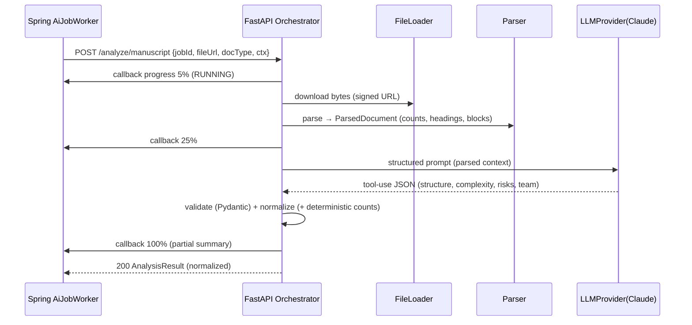
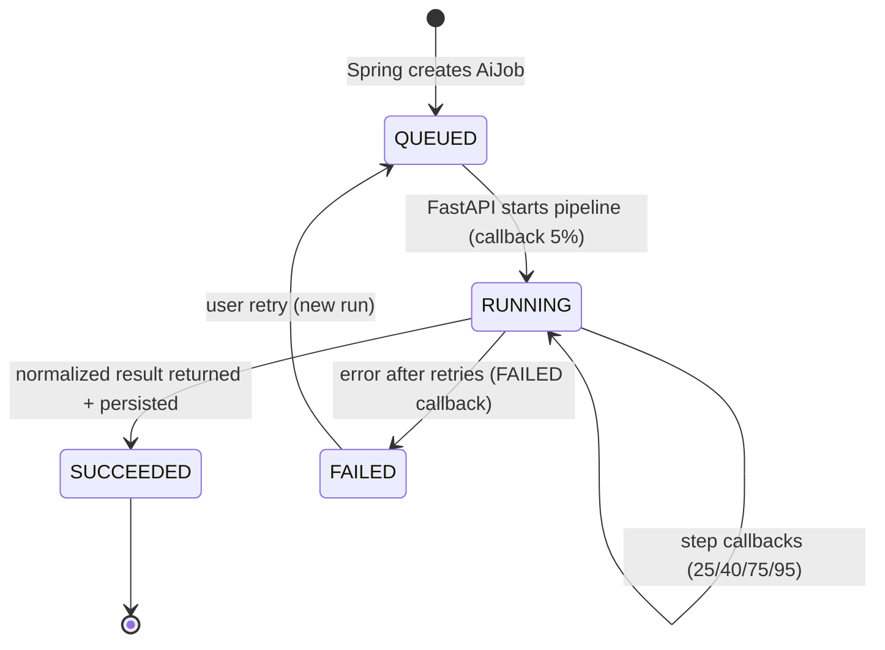
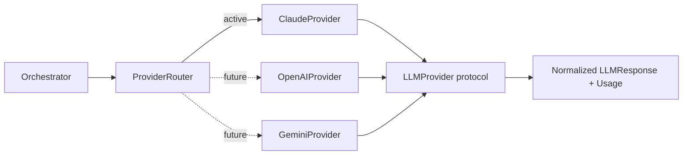
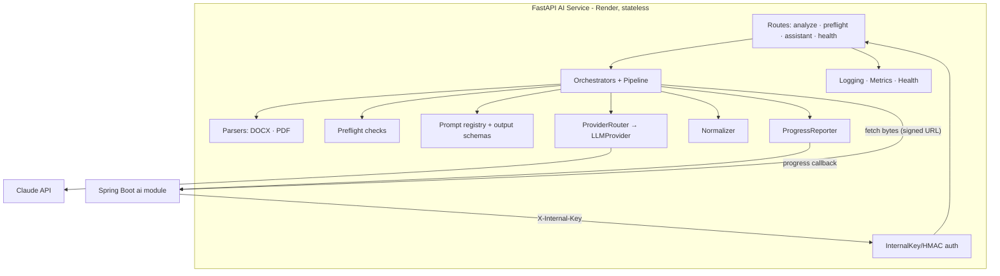

# Protrack — Phase 1 MVP · FastAPI AI Service Architecture

> Status: Final architecture artifact, pre-implementation. No implementation code.
> Python 3.12 · FastAPI · Anthropic SDK (Claude) · python-docx · pdfplumber/pypdf · Render.
> The AI Service is **stateless**; Spring Boot owns all persistence and job state.

---

## 1. Role & principles

- **Single responsibility:** turn a document + context into **normalized, confidence-scored AI results**. It parses, prompts an LLM, validates, normalizes — and returns. It never writes to the database and never decides workflow.
- **Stateless & idempotent:** no DB, no session. Given the same input it produces the same shape; safe to retry. All state (`AiJob`, results) lives in Spring/Postgres.
- **Deterministic-first:** hard facts (counts, page geometry, DPI) come from **deterministic parsers**; the LLM is used only for semantic structuring, judgement, and natural-language findings — each carrying a confidence (0–100, per approved convention).
- **Provider-agnostic:** Claude now, behind an `LLMProvider` abstraction so OpenAI/Gemini slot in later with no orchestration change.
- **Contract-bound:** request/response schemas are the exact shapes the Spring `ai`/`analysis`/`preflight` modules expect, so persistence is a 1:1 map.

---

## 2. Folder structure

```
ai-service/
├── app/
│   ├── main.py                     # FastAPI app, lifespan, middleware, exception handlers
│   ├── api/
│   │   ├── deps.py                 # internal-auth dependency, settings, provider injection
│   │   └── routes/
│   │       ├── analyze.py          # POST /internal/v1/analyze/manuscript
│   │       ├── preflight.py        # POST /internal/v1/preflight/pdf
│   │       ├── assistant.py        # POST /internal/v1/assistant/chat
│   │       └── health.py           # GET /internal/v1/health, /ready
│   ├── core/
│   │   ├── config.py               # Settings (pydantic-settings, env-driven)
│   │   ├── security.py             # X-Internal-Key / HMAC verification, replay guard
│   │   ├── logging.py              # structlog JSON + trace-id propagation
│   │   ├── observability.py        # Prometheus metrics, timing helpers
│   │   └── errors.py               # AiServiceError hierarchy + handlers
│   ├── orchestration/
│   │   ├── analysis_orchestrator.py
│   │   ├── preflight_orchestrator.py
│   │   ├── assistant_orchestrator.py
│   │   ├── pipeline.py             # step runner (load→parse→prompt→call→validate→normalize)
│   │   └── progress.py             # ProgressReporter → callback client to Spring Boot
│   ├── providers/                  # LLM abstraction
│   │   ├── base.py                 # LLMProvider protocol + LLMResponse/Usage
│   │   ├── claude_provider.py      # Anthropic SDK, tool-use structured output
│   │   ├── openai_provider.py      # (future) function-calling / JSON mode
│   │   ├── gemini_provider.py      # (future) response-schema
│   │   ├── router.py               # provider selection by config/job
│   │   └── retry.py                # tenacity policies (backoff, classify errors)
│   ├── parsers/
│   │   ├── base.py                 # DocumentParser protocol → ParsedDocument
│   │   ├── docx_parser.py          # python-docx
│   │   ├── pdf_parser.py           # pdfplumber (text/geometry) + pypdf (metadata/fonts)
│   │   ├── factory.py              # select by mime/doc_type
│   │   └── models.py               # ParsedDocument, ParsedBlock, Counts
│   ├── preflight/
│   │   ├── checks/                 # geometry, fonts, image_resolution, overflow,
│   │   │                           # placement, accessibility  (each a CheckFn)
│   │   ├── registry.py             # check registry (Phase-1 lightweight set)
│   │   └── runner.py               # run checks → CheckResult[] → LLM phrasing
│   ├── prompts/
│   │   ├── templates/              # versioned: manuscript_analysis.v1.jinja, etc.
│   │   ├── registry.py             # load + version + cache; returns prompt_id
│   │   └── output_schemas/         # JSON schemas for tool-use structured output
│   ├── schemas/                    # Pydantic DTOs (the contract)
│   │   ├── analysis.py  preflight.py  assistant.py  common.py  internal.py
│   ├── storage/
│   │   └── file_loader.py          # fetch bytes via signed URL (Phase 1) / presigned S3 (future)
│   └── services/
│       └── normalizer.py           # LLM output + parser facts → normalized response entities
├── tests/                          # parser fixtures, prompt golden tests, schema validation
├── pyproject.toml                  # deps, ruff, mypy
├── Dockerfile
└── README.md
```

---

## 3. AI orchestration

Each route delegates to an **orchestrator** that runs a linear **pipeline** of steps; after each step a `ProgressReporter` posts progress back to Spring (relayed to the client via SSE).

```
load_file → parse_document → build_prompt → call_llm(structured) → validate → normalize → respond
   5%            25%             40%            75%               85%        95%       100%
```

- **Processing model (Phase 1):** the Spring `AiJobWorker` makes a long-lived call; the FastAPI handler runs the pipeline **inline (async)**, emits progress callbacks at milestones, and returns the final normalized result in the HTTP response. Spring persists on return. (A future "accept + background-task + final callback" mode is a drop-in change; the orchestrator/pipeline don't change.)
- **Concurrency:** async I/O (httpx, async Anthropic client); CPU-bound parsing offloaded to a thread pool (`run_in_threadpool`) so the event loop stays responsive.
- **Cancellation/timeout:** per-step timeouts; overall request deadline; on breach → `FAILED` progress callback + error response.



---

## 4. Claude API integration

- **`ClaudeProvider`** wraps the **async Anthropic SDK**. Structured output via **tool-use**: a single forced tool whose `input_schema` is the response JSON schema, so Claude returns validated structured data (not free text to parse).
- **Inputs:** a versioned **system prompt** (role, rules, output contract) + a **user message** containing the parsed document context (counts, headings, sampled text) — **document text is clearly delimited and treated as untrusted data** (prompt-injection guard).
- **Config:** model id, max tokens, temperature (low for analysis/QA determinism) from `Settings`; the Claude API key lives **only** in the AI service env (never in Spring).
- **Usage capture:** token counts + latency returned in `LLMResponse.usage`, surfaced as metrics and echoed to Spring for the `ai_jobs` record (model/provider/duration).
- **Cost control:** sample/truncate very large documents (send structure + representative excerpts, not the whole book); cache identical analyses by input hash.

---

## 5. Document parsing flow (DOCX, PDF)

A `DocumentParser` protocol → `ParsedDocument` (uniform shape regardless of source):

```
ParsedDocument = { counts{pages,figures,tables,equations,problems,references},
                   headings[{level,text}], blocks[…sampled…],
                   fonts[], pageGeometry?, images[{dpi,colorspace}]?, language? }
```

- **DOCX (`python-docx`):** walk paragraphs/styles → heading levels (H1/H2/H3), count figures/tables/equation objects, extract references section, body sampling for the LLM. Counts are **deterministic**.
- **PDF (`pdfplumber` + `pypdf`):** `pdfplumber` for text/positions/geometry (page size, bleed/trim hints, overflow heuristics, image bboxes/DPI sampling); `pypdf` for metadata, embedded-font presence, page count, basic tag/accessibility presence. Used both for **manuscript PDFs** (analysis) and **production PDFs** (preflight).
- **`factory.py`** picks the parser by mime/doc_type. Phase-1 supports **DOCX + PDF**; XML/LaTeX/EPUB/IDML parsers register here later with **no orchestration change**.
- **Separation of concerns:** parsers produce *facts*; the LLM produces *judgement*. The normalizer merges them — counts always come from the parser, never the model.

---

## 6. Prompt management strategy

- **Versioned templates** in `prompts/templates/` (Jinja2), named `<task>.v<N>.jinja`; `registry.py` loads + caches and returns a stable `prompt_id` (e.g. `manuscript_analysis.v1`) that is **stamped onto every result** for traceability/repro.
- **System vs user split:** static rules/contract in the system prompt; dynamic parsed context in the user message; **few-shot exemplars** kept in the template, not hard-coded.
- **Structured-output schemas** in `prompts/output_schemas/` are the single source of truth shared by the tool-use definition *and* the Pydantic response models (generated/kept in sync) — guaranteeing the model's output matches the DB contract.
- **Guardrails baked into prompts:** untrusted-document delimiting, "advisory only / include confidence", refusal/uncertainty handling, no fabrication of counts.
- **Provider-neutral authoring:** templates are provider-agnostic; each provider adapter formats them into its own structured-output mechanism.

---

## 7. Response schemas (the contract)

Pydantic models mirror the normalized DB shape exactly (confidence 0–100; enums match `VARCHAR + CHECK` sets):

- **`AnalysisResult`** — `overallConfidence`, `summary`, `language`, `complexityScore`, `complexityLabel`, `estimatedWorkingDays`, `metrics[]{key,value,confidence}`, `composition[]{segment,percentage}`, `headings[]{level,count}`, `risks[]{severity,title,description}`, `suggestedTeam[]{role,matchScore,rationale, candidateHint}`, `promptId`, `model`, `usage`.
- **`PreflightResult`** — `overallScore`, `passed`, `standard`, `checks[]{key,result(PASS|REVIEW|FAIL),detail}`, `issues[]{category,severity,title,recommendation,pageRef,source}`, `totals{issues,high}`, `promptId`, `model`, `usage`.
- **`AssistantReply`** — `reply`, `citations[]?`, `usage`.
- **`internal.py`** — `ProgressCallback{jobId,progressPct,status,partial?}`, `ErrorPayload{code,message,retryable}`.

Validation failure → the model output is rejected and retried (Section 8), never passed through unvalidated.

---

## 8. Error handling & retry strategy

- **Error taxonomy:** `TransientProviderError` (429/5xx/timeouts → retry), `ValidationError` (schema mismatch → retry with repair hint, bounded), `PermanentError` (bad input, unsupported format → fail fast), `DownstreamError` (file fetch).
- **Retries:** `tenacity` exponential backoff + jitter for transient provider/network errors; respect provider `Retry-After`; capped attempts. Structured-output validation gets a bounded "repair" retry (re-prompt with the validation error).
- **Timeouts:** per-LLM-call and per-request deadlines; CPU parsing guarded too.
- **Graceful degradation:** on final failure, post a `FAILED` progress callback and return a structured `ErrorPayload` — Spring marks the `AiJob` FAILED and the UI offers retry. **Never** a bare 500 to the user-facing flow.
- **Partial results:** where safe (e.g. deterministic counts succeeded but LLM judgement failed), return partial + `degraded: true` so the UI can still show metrics.

---

## 9. AI job lifecycle

Spring owns the `AiJob`; FastAPI is a **stateless progress reporter** against a `jobId` it receives.


- `ProgressReporter.post(jobId, pct, status, partial?)` → `POST /internal/v1/ai-jobs/{jobId}/progress` on Spring (authenticated with the internal key). Spring relays to the client over SSE.
- Idempotency: a retried run uses a new `jobId`; FastAPI holds nothing to reconcile.

---

## 10. Logging, monitoring, observability

- **Logging:** `structlog` JSON; the **`trace-id` is propagated from Spring** via header and bound to every log line (end-to-end correlation across both services). Per-step timings logged; **no document content, PII, or secrets** in logs (only counts/metadata).
- **Metrics (Prometheus):** request rate/latency per route, **LLM call latency, token usage, cost estimate, error/retry counts**, parser durations, preflight pass rates. Exposed at `/metrics` (instrumentator).
- **Health:** `/internal/v1/health` (liveness) and `/ready` (checks provider reachability + config) for Render probes; `health` reports active provider + model.
- **Tracing (optional/future):** OpenTelemetry spans around parse/LLM/normalize, joined to Spring's trace.

---

## 11. Security between Spring Boot and FastAPI

- **Authentication:** every request must carry **`X-Internal-Key`** (shared secret) — upgradeable to **HMAC** (`X-Signature` = HMAC(secret, timestamp + body) + `X-Timestamp`) with a short freshness window to prevent **replay**. Missing/invalid → `401`, request rejected before any work.
- **Network:** the AI service exposes **only** `/internal/*`; CORS effectively closed (no browser origin); ideally reachable only from the Spring service (platform networking/allowlist).
- **Secrets:** Claude key + internal key in the AI service env only; never logged; rotated via env.
- **Input hardening:** max file size, allowed mime types, request body limits, per-caller rate limiting; document text treated as untrusted (prompt-injection mitigations in prompts).
- **No data at rest:** files are fetched, processed in memory/temp, and discarded; nothing persisted in the AI service.

---

## 12. Model abstraction (Claude → OpenAI / Gemini ready)


- **`LLMProvider` protocol:** `generate_structured(system, user, output_schema, options) -> LLMResponse` where `LLMResponse = {data: dict (schema-valid), usage: {inputTokens, outputTokens, model}, raw}`.
- **Adapters** translate the provider-neutral call into each vendor's structured-output mechanism: Claude **tool-use**, OpenAI **function-calling/JSON mode**, Gemini **response schema**. Differences (token fields, finish reasons, safety blocks) are normalized in the adapter.
- **`ProviderRouter`** selects by config/`Settings` (and optionally per-job override); orchestrators/prompts are unchanged when the provider changes — only config. Usage/cost normalized for uniform metrics.

---

## 13. AI results → normalized database entities

FastAPI returns **already-normalized JSON**; the Spring `ai`/`analysis`/`preflight` modules map it 1:1 into rows (the LLM never touches the DB).

| FastAPI response field | Spring mapper | DB table(s) |
|---|---|---|
| `AnalysisResult` header (confidence, summary, language, complexity, estDays) | AnalysisMapper | `analysis_results` (+ `raw_payload` JSONB = full response for provenance) |
| `metrics[]` | → rows | `analysis_metrics` |
| `composition[]` | → rows | `analysis_composition` |
| `headings[]` | → rows | `analysis_headings` |
| `risks[]` | → rows | `analysis_risks` |
| `suggestedTeam[]` (role+matchScore+rationale) | resolve candidate → user | `team_suggestions` |
| `PreflightResult` header (score, passed, standard, totals) | PreflightMapper | `preflight_runs` |
| `checks[]` | → rows | `preflight_checks` |
| `issues[]` (category, severity, recommendation, pageRef, source=AI) | → rows | `qa_issues` |
| `usage`/`model`/`promptId` | job metadata | `ai_jobs` (provider, model, duration) |
| `AssistantReply.reply` | AssistantService | `assistant_messages` |

**Why this split:** keeping normalization in the AI service (against a shared schema) means Spring persistence is mechanical and stable; `raw_payload` preserves the full model output for audit/repro without polluting normalized columns. Confidence/severity/enum values already conform to the approved DB conventions, so no translation is needed.

---

## 14. Component diagram



---

## 15. Closing

The AI Service is **stateless, deterministic-first, provider-agnostic, and contract-bound**: it parses with deterministic libraries, reasons with Claude behind a swappable abstraction, validates against schemas that match the database exactly, reports progress for SSE, and returns normalized results that Spring persists 1:1. Security (internal key/HMAC, secrets isolation, untrusted-input handling), resilience (typed errors + bounded retries + graceful degradation), and observability (correlated JSON logs + Prometheus + health) are designed in.

This **completes the architectural design** (Solution → Database → API → Backend → Frontend → AI Service). The system is ready for an implementation plan / work breakdown when you are.
```
