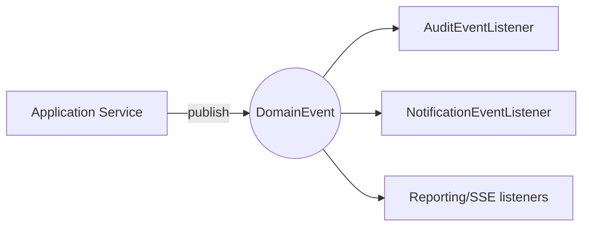
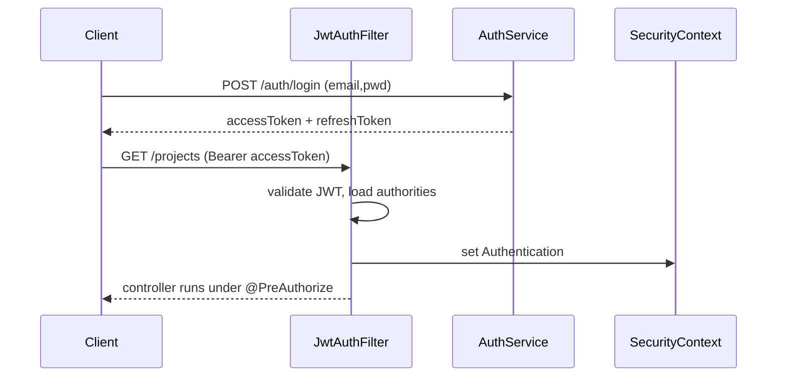
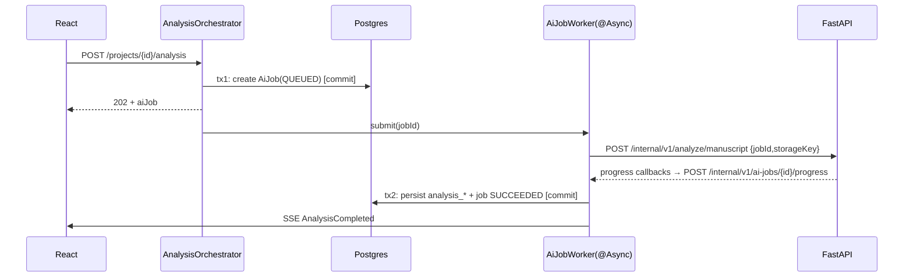
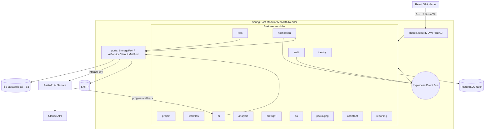
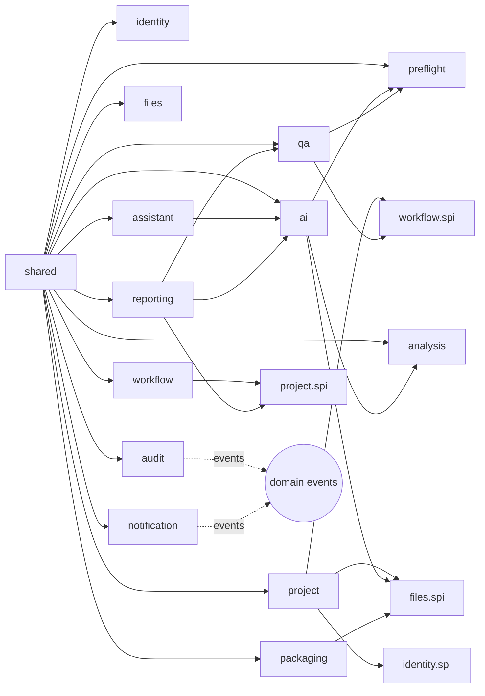

# Protrack — Phase 1 MVP · Backend Architecture (Spring Boot 3)

> Status: Design artifact, pre-implementation. No implementation code.
> Java 21 · Spring Boot 3.x · Modular Monolith · PostgreSQL (Neon) · FastAPI AI sidecar.
> Aligns to approved Solution Architecture, Database Design, and REST API Specification.

---

## 1. Architectural style & layering

A **modular monolith**: one deployable Spring Boot app, internally partitioned into business modules with hard boundaries. Within each module a classic layered flow:

```
HTTP → Controller (web) → Application Service (use-case, @Transactional)
        → Domain (entities, domain services, repository ports)
        → Repository (Spring Data JPA) → PostgreSQL
        ↘ Mapper (MapStruct) for DTO⇄Entity
        ↘ DomainEvent (ApplicationEventPublisher) → async subscribers (audit, notification)
        ↘ Outbound ports (StoragePort, AiServiceClient, MailPort) → adapters
```

**Boundary rule:** a module may call another module **only** through that module's published interface in its `spi` package. No cross-module repository or entity access. Cross-cutting reactions (audit, notifications) happen via **domain events**, not direct calls — keeping modules decoupled.

---

## 2. Package structure

```
com.protrack
├── ProtrackApplication
│
├── shared/                                  // cross-cutting, no business logic
│   ├── config/        SecurityConfig, AsyncConfig, WebClientConfig, JacksonConfig,
│   │                  OpenApiConfig, CorsConfig, FlywayConfig, ActuatorConfig
│   ├── security/      JwtService, JwtAuthenticationFilter, InternalKeyFilter,
│   │                  ProtrackUserDetails, ProtrackUserDetailsService,
│   │                  SecurityUtils, @CurrentUser, ProjectPermissionEvaluator
│   ├── error/         GlobalExceptionHandler, Problem, ApiException,
│   │                  NotFoundException, ConflictException, ValidationException,
│   │                  ForbiddenException, InvalidTransitionException
│   ├── events/        DomainEvent (base), DomainEventPublisher
│   ├── audit/         Auditable (mapped superclass), AuditorAwareImpl
│   ├── web/           PageResponse<T>, ApiResponse, CorrelationIdFilter
│   ├── storage/       StoragePort, LocalDiskStorageAdapter, S3StorageAdapter (future)
│   ├── mail/          MailPort, SmtpMailAdapter
│   └── properties/    ProtrackProperties (@ConfigurationProperties: jwt, storage, ai, mail)
│
├── identity/
│   ├── web/           AuthController, UserController, RoleController, dto/...
│   ├── service/       AuthService, UserService, TokenService
│   ├── domain/        User, Role, Permission, RefreshToken, enums, events
│   ├── repository/    UserRepository, RoleRepository, RefreshTokenRepository
│   ├── mapper/        UserMapper
│   └── spi/           IdentityFacade (lookup users/roles for other modules)
│
├── project/
│   ├── web/           ProjectController, ProjectMemberController, DashboardController, dto/
│   ├── service/       ProjectService, ProjectMemberService, DashboardService
│   ├── domain/        Project, ProjectMember, events (ProjectCreated, MemberAssigned)
│   ├── repository/    ProjectRepository, ProjectMemberRepository
│   ├── mapper/        ProjectMapper
│   └── spi/           ProjectFacade
│
├── workflow/
│   ├── web/           WorkflowController (transitions, timeline), dto/
│   ├── service/       WorkflowService, StageTransitionGuard
│   ├── domain/        WorkflowStage, ProjectStageHistory, StageTransition (rules),
│   │                  events (StageChanged)
│   ├── repository/    WorkflowStageRepository, StageHistoryRepository
│   └── spi/           WorkflowFacade   // requestTransition(projectId, toStage, actor)
│
├── files/
│   ├── web/           DocumentController, FileVersionController, dto/
│   ├── service/       DocumentService, FileVersionService, UploadService
│   ├── domain/        Document, FileVersion, events (FileUploaded)
│   ├── repository/    DocumentRepository, FileVersionRepository
│   ├── mapper/        DocumentMapper
│   └── spi/           FilesFacade   // resolve version → storageKey for AI/packaging
│
├── ai/
│   ├── web/           AnalysisController, PreflightController, AiJobController,
│   │                  SseController, RecommendationController,
│   │                  InternalAiCallbackController (/internal/v1), dto/
│   ├── service/       AiJobOrchestrator, AnalysisOrchestrator, PreflightOrchestrator,
│   │                  RecommendationService, SseService, AiJobWorker (@Async)
│   ├── domain/        AiJob, enums (JobType, JobStatus), events (AiJobStarted,
│   │                  AnalysisCompleted, PreflightCompleted, AiJobFailed)
│   ├── repository/    AiJobRepository
│   ├── client/        AiServiceClient (port), FastApiClient (RestClient adapter),
│   │                  AiClientResilience (Resilience4j)
│   └── spi/           AiFacade
│
├── analysis/
│   ├── web/           (read endpoints folded into ai/AnalysisController) dto/
│   ├── service/       AnalysisResultService
│   ├── domain/        AnalysisResult, AnalysisMetric, AnalysisComposition,
│   │                  AnalysisHeading, AnalysisRisk, TeamSuggestion
│   ├── repository/    AnalysisResultRepository (+ children)
│   └── mapper/        AnalysisMapper
│
├── preflight/
│   ├── service/       PreflightResultService
│   ├── domain/        PreflightRun, PreflightCheck, QaIssue
│   ├── repository/    PreflightRunRepository, QaIssueRepository
│   └── mapper/        PreflightMapper
│
├── qa/
│   ├── web/           IssueController, SignoffController, ApprovalController, dto/
│   ├── service/       IssueDecisionService, SignoffService, ApprovalService
│   ├── domain/        QaIssueDecision, QaSignoff, Approval, events (QaSignedOff, IssueDecided)
│   ├── repository/    IssueDecisionRepository, SignoffRepository, ApprovalRepository
│   └── mapper/        QaMapper
│
├── packaging/
│   ├── web/           PackageController, dto/
│   ├── service/       PackageAssemblyService, PackageDownloadService
│   ├── domain/        ProductionPackage, PackageItem, events (PackageAssembled)
│   └── repository/    PackageRepository, PackageItemRepository
│
├── assistant/
│   ├── web/           AssistantController, dto/
│   ├── service/       AssistantService
│   ├── domain/        AssistantThread, AssistantMessage
│   └── repository/    AssistantThreadRepository, AssistantMessageRepository
│
├── notification/
│   ├── web/           NotificationController, PreferenceController, dto/
│   ├── service/       NotificationService, NotificationDispatcher (in-app + email)
│   ├── domain/        Notification, NotificationPreference
│   ├── listener/      NotificationEventListener (@TransactionalEventListener)
│   └── repository/    NotificationRepository, PreferenceRepository
│
├── audit/
│   ├── web/           AuditController (list, CSV export, project activity)
│   ├── service/       AuditService, AuditCsvExporter
│   ├── domain/        AuditEvent (immutable)
│   ├── listener/      AuditEventListener (@TransactionalEventListener, ALL domain events)
│   └── repository/    AuditEventRepository (insert/select only)
│
└── reporting/
    ├── web/           ReportController, dto/
    ├── service/       ReportService, ReportSnapshotJob (@Scheduled)
    ├── domain/        ReportSnapshot
    └── repository/    ReportSnapshotRepository (+ native aggregate queries)
```

---

## 3. Modules & responsibilities

| Module | Responsibility | Publishes (spi) | Consumes |
|---|---|---|---|
| **shared** | security, errors, events, storage/mail ports, config, pagination | ports | — |
| **identity** | users, roles, permissions, login, JWT, refresh tokens | IdentityFacade | — |
| **project** | project aggregate, members, dashboard | ProjectFacade | identity, workflow, files, ai (read), reporting |
| **workflow** | canonical stages + guarded transitions + history (the backbone) | WorkflowFacade | project, identity |
| **files** | documents, immutable versions, uploads, storage | FilesFacade | storage port |
| **ai** | job orchestration, FastAPI client, SSE, recommendations | AiFacade | files, analysis, preflight |
| **analysis** | persisted manuscript-analysis read model | — | ai |
| **preflight** | preflight runs, checks, issues | — | ai |
| **qa** | issue decisions, e-sign sign-off, approvals | — | preflight, workflow |
| **packaging** | assemble + download production bundle | — | files |
| **assistant** | scoped project chat | — | ai |
| **notification** | in-app + email, fan-out from events | — | identity (recipients) |
| **audit** | immutable business audit log + activity + export | — | (all events) |
| **reporting** | KPI snapshots + live aggregates | — | project, qa, ai |

---

## 4. Component layering — what each stereotype does

- **Controllers (`web`)** — thin: bind/validate request DTOs (`@Valid`), call one application service, map to response DTO, set status. No business logic, no `@Transactional`.
- **Application Services (`service`)** — the use-case layer. Own the **transaction boundary** (`@Transactional`), orchestrate domain + repositories + ports, publish domain events. One public method = one use case.
- **Domain (`domain`)** — JPA entities + enums + domain services holding invariant logic (e.g. `StageTransition` rules, sign-off validity). Entities extend `Auditable`.
- **Repositories (`repository`)** — Spring Data JPA interfaces; custom queries via `@Query`/Specifications for filtering/sorting; projections for read models.
- **DTOs** — request (`*Request`) and response (`*Response`) records, separate from entities; never expose entities over HTTP.
- **Mappers** — **MapStruct** for DTO⇄entity; keeps controllers/services clean and consistent.
- **Validators** — Bean Validation annotations on request DTOs + custom `ConstraintValidator`s (ISBN, allowed file type/size, transition legality where cheap). Cross-field/business validation lives in services and raises `ValidationException`/`ConflictException`.
- **Security** — filters + method security (Section 6).
- **Exception handling** — one `@RestControllerAdvice` `GlobalExceptionHandler` maps exceptions → Problem (Section 9).

---

## 5. Inter-module communication

**Synchronous (request path):** through `spi` facades only.
```
ProjectService.createProject()
   → WorkflowFacade.initialize(projectId, INTAKE)
   → IdentityFacade.resolveMembers(memberIds)
```
Facades expose **DTOs/ids**, never entities, so modules stay decoupled and independently testable.

**Asynchronous (reactions):** in-process domain events via `ApplicationEventPublisher`.

Listeners use `@TransactionalEventListener(phase = AFTER_COMMIT)` so they fire **only when the originating transaction commits**, and run in a new transaction (`REQUIRES_NEW`) so a notification failure never rolls back the business operation. This makes `audit` and `notification` pure subscribers with zero inbound coupling.

**Why events for audit/notification:** every state change already publishes an event; audit and notifications become cross-cutting concerns that any module gets "for free" without the module knowing they exist.

---

## 6. Authentication & Authorization (Spring Security + JWT)

**Filter chain (stateless):**
```
Request
 → CorrelationIdFilter (MDC traceId)
 → JwtAuthenticationFilter        (public paths skipped; else validate JWT → SecurityContext)
 → [for /internal/v1] InternalKeyFilter (X-Internal-Key/HMAC)
 → Authorization (path rules + method security)
 → Controller
```

- **Login:** `AuthService` verifies email + BCrypt password → `TokenService` issues **access JWT** (~15 min, claims: `sub`, `roles`, `permissions`, `orgId`) + **refresh token** (persisted, rotated in `refresh_tokens`).
- **Validation:** `JwtAuthenticationFilter` parses/validates signature+expiry, loads authorities from claims, builds `ProtrackUserDetails`, sets `SecurityContext`. No DB hit on the hot path (authorities in token); `ProtrackUserDetailsService` used at login/refresh.
- **RBAC:** roles → `ROLE_ADMIN|ROLE_PM|ROLE_DESIGNER|ROLE_QA`; permissions → granular authorities. Two enforcement layers:
  - **Path-based** in `SecurityConfig` (coarse: `/api/v1/users/**` → ADMIN; `/internal/**` → internal key).
  - **Method-level** `@PreAuthorize` (fine: role + ownership + stage).
- **Contextual guards (beyond roles):** a `ProjectPermissionEvaluator` + `StageTransitionGuard` answer "is this user a member of this project?" and "is this transition legal for this role at this stage?", e.g. `@PreAuthorize("@projectPerm.isMember(#id) and @workflowGuard.canSignoff(#id)")`. **Never trust the client** — transitions are validated server-side.
- **Passwords:** BCrypt; reset via signed single-use token emailed by `notification`.
- **Future-ready:** the auth provider is abstracted so OIDC/Keycloak/Azure AD slot behind the same `SecurityContext` later.



---

## 7. FastAPI AI Service integration

**Port + adapter:** `AiServiceClient` (interface in `ai/client`) with `FastApiClient` adapter using Spring **RestClient** (sync, simple, timeouts) wrapped in **Resilience4j** (timeout, retry with backoff, circuit breaker). Every call carries `X-Internal-Key`. Provider/model are echoed back and stored on `AiJob`.

**Async orchestration (no external I/O inside a DB transaction):**

- **Inbound callback:** `InternalAiCallbackController` (secured by `InternalKeyFilter`) receives progress/partial/final → updates `AiJob` → `SseService` pushes to subscribers → publishes `AnalysisCompleted`/`PreflightCompleted`.
- **SSE:** `SseService` holds an `SseEmitter` registry keyed by `projectId` (+ user); heartbeats keep it alive; fallback is client poll of `GET /ai-jobs/{id}`.
- **Failure:** circuit-open or timeout → job marked `FAILED` with message; UI offers retry; never a 500 to the user.
- **Swap-ability:** today direct `@Async` dispatch; the `AiJobWorker` sits behind an `AiJobDispatcher` port so moving to RabbitMQ/SQS later is an adapter change, not a rewrite.

---

## 8. Domain events & asynchronous processing

**Event catalog (published by services):** `ProjectCreated`, `MemberAssigned`, `FileUploaded`, `StageChanged`, `AiJobStarted`, `AnalysisCompleted`, `PreflightCompleted`, `AiJobFailed`, `IssueDecided`, `QaSignedOff`, `PackageAssembled`, `RecommendationResolved`.

**Consumers:**
- `AuditEventListener` → writes an `audit_event` for **every** domain event (the business audit log).
- `NotificationEventListener` → fans out in-app + email per event type and recipient rules.
- `SseService` → relays progress/stage events to subscribed clients.
- `reporting` → optionally updates counters.

**Async executors (`AsyncConfig`):**
- `aiExecutor` — bounded pool for FastAPI calls (the long jobs).
- `notificationExecutor` — email send-off (so SMTP latency never blocks requests).
- `@Scheduled` `ReportSnapshotJob` — periodic KPI rollups into `report_snapshots`.

All event listeners run **AFTER_COMMIT** so side effects never occur for rolled-back operations.

---

## 9. Transaction boundaries

- **Boundary = application-service method** (`@Transactional`). Controllers and repositories never define boundaries.
- **Reads:** `@Transactional(readOnly = true)` for list/detail/report queries.
- **External I/O is never inside a transaction.** AI calls, file-binary writes, and email send happen **outside** DB transactions; the pattern is *short tx (create/lookup) → external call → short tx (persist results)*.
- **Event side-effects** run in their own `REQUIRES_NEW` transaction after the main commit, isolating failures.
- **File upload:** write binary to storage first (idempotent by checksum), then a short tx records `file_version` metadata — so a failed metadata write never orphans nothing critical, and a failed upload writes no metadata.
- **Sign-off:** a single transaction records `qa_signoff` + `approval` + the `COMPLETED` stage transition atomically (all-or-nothing), then emits `QaSignedOff` after commit.
- **Audit immutability** reinforced by DB grants (app role: INSERT/SELECT on `audit_events`).

---

## 10. Logging, auditing, monitoring, configuration

**Logging**
- SLF4J + Logback, **JSON** in prod. `CorrelationIdFilter` puts a `traceId` in MDC (returned in every Problem + log line) for end-to-end tracing across Spring↔FastAPI (propagated via header).
- Request/response summary logging (method, path, status, latency, user, traceId); WARN/ERROR with stack context; secrets/PII never logged.

**Auditing (two layers)**
1. **Technical** — JPA auditing fills `created_at/updated_at/created_by/updated_by` via `@CreatedDate/@LastModifiedDate/@CreatedBy` and `AuditorAwareImpl` (reads current user from `SecurityContext`).
2. **Business** — `audit_events` written by `AuditEventListener` from domain events (who/what/when + JSON metadata). Immutable; powers the audit log, CSV export, and the workspace Activity tab.

**Monitoring**
- Spring Boot **Actuator** + **Micrometer**: `/actuator/health` (DB, AI service, storage health indicators), `/actuator/metrics`, `/actuator/prometheus`. Custom metrics: AI job duration/success rate, queue depth, preflight pass rate. Readiness/liveness for Render.

**Configuration management**
- Spring **profiles** (`dev`, `prod`); all secrets via **environment variables** on Render (DB URL, JWT secret, internal AI key, Claude key lives only in FastAPI, SMTP creds).
- Typed `@ConfigurationProperties` (`ProtrackProperties`): `jwt.*`, `storage.*` (driver: local|s3), `ai.*` (baseUrl, internalKey, timeouts), `mail.*`.
- **Flyway** owns schema; migrations run on boot. CORS locked to the Vercel origin per environment.

---

## 11. Diagrams

### 11.1 Component diagram


### 11.2 Package / dependency diagram

Dependencies point **inward to `spi` interfaces**; `audit`/`notification` depend on no module — only on events.

---

## 12. REST API → backend service mapping (representative)

| API | Controller | Application Service | Key tables | Tx | Events |
|---|---|---|---|---|---|
| `POST /auth/login` | AuthController | AuthService.login | users, refresh_tokens | RW | — |
| `GET /me` | AuthController | UserService.currentProfile | users, roles, permissions | RO | — |
| `GET /dashboard` | DashboardController | DashboardService.forUser | projects, members, recommendations, report_snapshots | RO | — |
| `POST /projects` | ProjectController | ProjectService.create → WorkflowFacade.initialize | projects, project_members, project_stage_history | RW | ProjectCreated |
| `POST /projects/{id}/manuscript` | DocumentController | UploadService.uploadManuscript | documents, file_versions | RW | FileUploaded |
| `POST /projects/{id}/analysis` | AnalysisController | AnalysisOrchestrator.start | ai_jobs | RW (tx1) | AiJobStarted |
| (callback) `/internal/.../progress` | InternalAiCallbackController | AiJobWorker.onProgress/onComplete | ai_jobs, analysis_* | RW (tx2) | AnalysisCompleted |
| `GET /projects/{id}/analysis` | AnalysisController | AnalysisResultService.latest | analysis_* | RO | — |
| `POST /projects/{id}/pdf` | DocumentController | UploadService.uploadPdf → WorkflowFacade.transition | documents, file_versions, project_stage_history | RW | FileUploaded, StageChanged |
| `POST /projects/{id}/preflight` | PreflightController | PreflightOrchestrator.start | ai_jobs | RW | AiJobStarted |
| `POST /issues/{id}/decision` | IssueController | IssueDecisionService.decide | qa_issue_decisions, qa_issues | RW | IssueDecided |
| `POST /projects/{id}/signoff` | SignoffController | SignoffService.sign | qa_signoffs, approvals, project_stage_history | RW (atomic) | QaSignedOff, StageChanged |
| `GET /projects/{id}/package` | PackageController | PackageAssemblyService.get | production_packages, package_items | RO | — |
| `POST /projects/{id}/assistant/messages` | AssistantController | AssistantService.ask → AiServiceClient | assistant_threads, assistant_messages, ai_jobs | RW | — |
| `GET /notifications` | NotificationController | NotificationService.feed | notifications | RO | — |
| `GET /audit-events` | AuditController | AuditService.search | audit_events | RO | — |
| `GET /reports/overview` | ReportController | ReportService.overview | report_snapshots (+ live views) | RO | — |
| `GET /projects/{id}/events` | SseController | SseService.subscribe | (in-memory) | — | relays events |

Every endpoint in the API spec resolves to exactly one application-service method in exactly one module — controllers stay thin and the module that owns the data owns the logic.

---

## 13. Modularity, maintainability, scalability

- **Modularity:** package-by-module + `spi`-only cross-talk + event-driven cross-cutting means each module is independently understandable, testable, and (later) extractable into a service if needed. Spring Modulith can enforce these boundaries in tests.
- **Maintainability:** uniform layering, MapStruct mapping, one global exception handler, typed config, and a single event/audit mechanism reduce per-feature ceremony; the package tree mirrors the DB domains and the API modules 1:1.
- **Scalability:** stateless app (JWT) scales horizontally once **file storage moves to S3** (the only stateful local dependency) and SSE/jobs move to a shared queue; AI work is already isolated behind an async dispatcher + separate FastAPI service that scales independently; heavy tables are partition-ready (per DB design). Resilience4j shields the app from AI latency/outages.
- **Phase-2 readiness:** auth provider, storage driver, AI dispatcher, and tenancy scoping are all abstractions — OIDC, S3, a real queue, and multi-tenancy slot in without structural change.

No blocking concerns. The backend architecture is modular, event-driven, transaction-safe, secured, observable, and consistent with the approved architecture, schema, and API contract.
```
