# Protrack — Phase 1 MVP · Database Design (PostgreSQL)

> Status: Design artifact, pre-implementation. No DDL / migrations.
> Target: PostgreSQL (Neon). Normalized to 3NF unless noted.
> Aligns to the approved modular-monolith architecture and the prototype's 16 screens.

---

## 1. Design Principles

- **3NF baseline.** Lookup/reference data (roles, stages, imprints, permissions) is normalized into tables so reporting and integrity are clean; high-churn enums that never need joins (status, severity) are kept as constrained `VARCHAR`/`CHECK` (or PG enums) for simplicity.
- **Surrogate keys.** Every table has a `BIGINT`/`UUID` surrogate `id` PK. **UUID v7** chosen for externally-exposed entities (users, projects, documents) to avoid enumeration and ease future distribution; `BIGINT` identity for high-volume internal logs is an acceptable alternative noted per table.
- **Standard audit columns.** Mutable tables carry `created_at, updated_at, created_by, updated_by`. Append-only tables (audit, history, decisions, notifications) carry only `created_at` (+ actor) — they are never updated.
- **Versioning is first-class.** A logical `documents` row points at many immutable `file_versions`; one is flagged current. Decisions/approvals/sign-offs are append-only histories, never overwritten.
- **Tenant-ready, single-tenant now.** Top-level entities carry `organization_id` (FK to a single seeded `organizations` row in Phase 1). All data access is scoped through this column so Phase-2 multi-tenancy is a switch, not a migration of every table.
- **Soft vs hard delete.** Operational entities use `deleted_at` soft-delete (preserves audit/history); reference data is hard-managed by Admin.
- **Referential integrity enforced in DB** (FKs + `ON DELETE` rules: `RESTRICT` for business data, `CASCADE` only for owned children like analysis sub-rows).

---

## 2. Schema Overview (domain groupings)

```
Identity & Access     organizations · users · roles · user_roles · permissions · role_permissions
Catalog / Reference   imprints · workflow_stages
Projects & Workflow   projects · project_members · project_stage_history · tasks
Documents & Files     documents · file_versions · production_packages · package_items
AI Intelligence       ai_jobs · analysis_results · analysis_metrics · analysis_composition ·
                      analysis_headings · analysis_risks · team_suggestions · ai_recommendations
Preflight & QA        preflight_runs · preflight_checks · qa_issues · qa_issue_decisions ·
                      approvals · qa_signoffs
Collaboration         comments · assistant_threads · assistant_messages
Platform Services     notifications · notification_preferences · audit_events · report_snapshots
```

---

## 3. ER Diagram (Mermaid)

```mermaid
erDiagram
    organizations ||--o{ users : has
    organizations ||--o{ imprints : has
    organizations ||--o{ projects : has

    users }o--o{ roles : "user_roles"
    roles }o--o{ permissions : "role_permissions"

    imprints ||--o{ projects : "published under"
    users ||--o{ projects : owns
    workflow_stages ||--o{ projects : "current stage"

    projects ||--o{ project_members : staffs
    users ||--o{ project_members : "member of"
    projects ||--o{ project_stage_history : transitions
    projects ||--o{ tasks : has
    users ||--o{ tasks : assigned

    projects ||--o{ documents : contains
    documents ||--o{ file_versions : versions
    projects ||--o{ production_packages : "handed off"
    production_packages ||--o{ package_items : bundles
    documents ||--o{ package_items : "referenced by"

    projects ||--o{ ai_jobs : runs
    ai_jobs ||--o| analysis_results : produces
    analysis_results ||--o{ analysis_metrics : has
    analysis_results ||--o{ analysis_composition : has
    analysis_results ||--o{ analysis_headings : has
    analysis_results ||--o{ analysis_risks : flags
    analysis_results ||--o{ team_suggestions : suggests
    users ||--o{ team_suggestions : "suggested as"
    projects ||--o{ ai_recommendations : surfaces

    ai_jobs ||--o| preflight_runs : produces
    file_versions ||--o{ preflight_runs : "reviews pdf"
    preflight_runs ||--o{ preflight_checks : includes
    preflight_runs ||--o{ qa_issues : raises
    qa_issues ||--o{ qa_issue_decisions : "triaged by"
    users ||--o{ qa_issue_decisions : decides

    projects ||--o{ approvals : "gated by"
    projects ||--o{ qa_signoffs : "signed off"
    preflight_runs ||--o| qa_signoffs : certifies
    users ||--o{ qa_signoffs : signs

    projects ||--o{ comments : discussed
    users ||--o{ comments : authors
    comments ||--o{ comments : replies

    projects ||--o{ assistant_threads : scoped
    users ||--o{ assistant_threads : opens
    assistant_threads ||--o{ assistant_messages : contains

    users ||--o{ notifications : receives
    projects ||--o{ notifications : about
    users ||--o{ notification_preferences : sets
    projects ||--o{ audit_events : recorded
    users ||--o{ audit_events : "acted by"

    organizations {
        uuid id PK
        string name
        string slug UK
        timestamptz created_at
    }
    users {
        uuid id PK
        uuid organization_id FK
        string email UK
        string password_hash
        string full_name
        string avatar_initials
        string avatar_color
        string status
        timestamptz last_login_at
        timestamptz created_at
        timestamptz updated_at
        uuid created_by
        uuid updated_by
    }
    roles {
        int id PK
        string code UK
        string name
        string description
    }
    user_roles {
        uuid user_id PK,FK
        int role_id PK,FK
        timestamptz assigned_at
        uuid assigned_by
    }
    permissions {
        int id PK
        string code UK
        string description
    }
    role_permissions {
        int role_id PK,FK
        int permission_id PK,FK
    }
    imprints {
        uuid id PK
        uuid organization_id FK
        string name
        string code UK
        timestamptz created_at
        timestamptz updated_at
    }
    workflow_stages {
        int id PK
        string code UK
        string name
        int sequence
        string description
    }
    projects {
        uuid id PK
        uuid organization_id FK
        uuid imprint_id FK
        uuid owner_id FK
        string title
        string isbn
        string publication_type
        string discipline
        text brief
        int page_extent
        string trim_size
        string priority
        string current_stage FK
        string status
        date due_date
        date created_date
        timestamptz created_at
        timestamptz updated_at
        uuid created_by
        uuid updated_by
        timestamptz deleted_at
    }
    project_members {
        uuid id PK
        uuid project_id FK
        uuid user_id FK
        string role_in_project
        boolean is_owner
        numeric match_score
        timestamptz assigned_at
        uuid assigned_by
    }
    project_stage_history {
        uuid id PK
        uuid project_id FK
        string from_stage
        string to_stage
        string triggered_role
        uuid triggered_by FK
        text note
        timestamptz occurred_at
    }
    tasks {
        uuid id PK
        uuid project_id FK
        uuid assignee_id FK
        string title
        text description
        string task_type
        string status
        string stage_code
        date due_date
        timestamptz created_at
        timestamptz updated_at
        uuid created_by
        uuid updated_by
    }
    documents {
        uuid id PK
        uuid project_id FK
        string doc_type
        string title
        uuid current_version_id FK
        string status
        timestamptz created_at
        timestamptz updated_at
        uuid created_by
        uuid updated_by
        timestamptz deleted_at
    }
    file_versions {
        uuid id PK
        uuid document_id FK
        int version_no
        string file_name
        string mime_type
        bigint size_bytes
        string storage_key
        string checksum_sha256
        boolean is_current
        uuid uploaded_by FK
        timestamptz created_at
    }
    production_packages {
        uuid id PK
        uuid project_id FK
        string status
        bigint total_size_bytes
        int item_count
        int download_count
        timestamptz assembled_at
        uuid assembled_by FK
        timestamptz created_at
        timestamptz updated_at
    }
    package_items {
        uuid id PK
        uuid package_id FK
        uuid document_id FK
        string item_type
        string label
        bigint size_bytes
        int sort_order
    }
    ai_jobs {
        uuid id PK
        uuid project_id FK
        string job_type
        string status
        int progress_pct
        string provider
        string model
        uuid input_version_id FK
        timestamptz started_at
        timestamptz finished_at
        int duration_ms
        text error_message
        timestamptz created_at
        uuid created_by
    }
    analysis_results {
        uuid id PK
        uuid ai_job_id FK
        uuid project_id FK
        numeric overall_confidence
        text summary
        string language
        int complexity_score
        string complexity_label
        int estimated_working_days
        jsonb raw_payload
        timestamptz created_at
    }
    analysis_metrics {
        uuid id PK
        uuid analysis_result_id FK
        string metric_key
        bigint metric_value
        numeric confidence
    }
    analysis_composition {
        uuid id PK
        uuid analysis_result_id FK
        string segment
        numeric percentage
    }
    analysis_headings {
        uuid id PK
        uuid analysis_result_id FK
        string level
        int count
    }
    analysis_risks {
        uuid id PK
        uuid analysis_result_id FK
        string severity
        string title
        text description
    }
    team_suggestions {
        uuid id PK
        uuid analysis_result_id FK
        uuid suggested_user_id FK
        string suggested_role
        numeric match_score
        text rationale
    }
    ai_recommendations {
        uuid id PK
        uuid project_id FK
        uuid source_job_id FK
        string category
        string title
        text detail
        numeric confidence
        string recommended_action
        string action_label
        string status
        uuid routed_to_user_id FK
        timestamptz created_at
        uuid resolved_by
        timestamptz resolved_at
    }
    preflight_runs {
        uuid id PK
        uuid ai_job_id FK
        uuid project_id FK
        uuid pdf_version_id FK
        string standard
        int overall_score
        boolean passed
        int total_issues
        int high_severity
        string status
        timestamptz ran_at
        timestamptz created_at
    }
    preflight_checks {
        uuid id PK
        uuid preflight_run_id FK
        string check_key
        string result
        text detail
        int sort_order
    }
    qa_issues {
        uuid id PK
        uuid preflight_run_id FK
        uuid project_id FK
        string category
        string severity
        string title
        text recommendation
        string page_ref
        string source
        string status
        timestamptz created_at
        timestamptz updated_at
    }
    qa_issue_decisions {
        uuid id PK
        uuid issue_id FK
        uuid decided_by FK
        string decision
        text comment
        timestamptz created_at
    }
    approvals {
        uuid id PK
        uuid project_id FK
        string stage_code
        string approval_type
        string decision
        string decided_role
        uuid decided_by FK
        text comment
        timestamptz created_at
    }
    qa_signoffs {
        uuid id PK
        uuid project_id FK
        uuid preflight_run_id FK
        uuid signed_by FK
        string decision
        int quality_score
        string signature_hash
        string artifact_checksum
        text notes
        timestamptz created_at
    }
    comments {
        uuid id PK
        uuid project_id FK
        uuid parent_comment_id FK
        uuid author_id FK
        string context_type
        uuid context_id
        text body
        timestamptz created_at
        timestamptz updated_at
        timestamptz deleted_at
    }
    assistant_threads {
        uuid id PK
        uuid project_id FK
        uuid user_id FK
        timestamptz created_at
    }
    assistant_messages {
        uuid id PK
        uuid thread_id FK
        string role
        text content
        int tokens
        uuid ai_job_id FK
        timestamptz created_at
    }
    notifications {
        uuid id PK
        uuid recipient_id FK
        uuid related_project_id FK
        string type
        string title
        text body
        string channel
        string related_entity_type
        uuid related_entity_id
        boolean is_read
        timestamptz read_at
        timestamptz sent_at
        timestamptz created_at
    }
    notification_preferences {
        uuid id PK
        uuid user_id FK
        string type
        boolean in_app_enabled
        boolean email_enabled
    }
    audit_events {
        uuid id PK
        uuid organization_id FK
        uuid project_id FK
        uuid actor_id FK
        string actor_type
        string event_type
        string entity_type
        uuid entity_id
        string summary
        jsonb metadata
        string correlation_id
        string ip_address
        timestamptz created_at
    }
    report_snapshots {
        uuid id PK
        uuid organization_id FK
        date period_start
        date period_end
        string metric_key
        string dimension
        numeric metric_value
        timestamptz generated_at
    }
```



---

## 4. Entity Catalog — why each table exists

### Identity & Access
- **organizations** — the tenancy root. One seeded row in Phase 1; every top-level entity FKs to it so multi-tenancy in Phase 2 needs no structural change. *Why:* future-ready isolation boundary.
- **users** — all platform accounts (the 4 staff roles). Holds credentials, profile, avatar initials/color used in the UI, status, last login. *Why:* authN/authZ subject + assignee of work.
- **roles** — reference table for ADMIN / PM / DESIGNER / QA. *Why:* normalized RBAC; reporting by role; avoids magic strings.
- **user_roles** — M:N users↔roles. *Why:* a user may hold multiple roles over time; the prototype's "Viewing as" is a demo affordance, but the real model must not hard-cap one role. Phase 1 typically one role/user.
- **permissions / role_permissions** — fine-grained capability grants mapped to roles. *Why:* lets authorization evolve beyond coarse role checks without schema change; Phase 1 may seed a minimal set.

### Catalog / Reference
- **imprints** — publishing imprints (Physical Sciences, Life Sciences, Engineering & CS, Mathematics). *Why:* projects are scoped/reported by imprint; per-imprint access in future.
- **workflow_stages** — the canonical 7 pipeline stages with ordering. *Why:* single source of truth for the state machine; `projects.current_stage` and history FK to it; drives the pipeline UI and stage-based reporting.

### Projects & Workflow
- **projects** — the central aggregate: title, ISBN, imprint, type/discipline, extent, trim size, priority, owner (PM), **current_stage**, status, due date. *Why:* the backbone entity every other domain hangs off.
- **project_members** — staffing: which users (and project-roles) are assigned, with the AI **match_score** and owner flag. *Why:* drives "Team", "My tasks", and AI team suggestions becoming real assignments.
- **project_stage_history** — append-only log of every stage transition (from→to, role, actor, note, time). *Why:* models the workflow as auditable events; powers the workflow timeline; immutable.
- **tasks** — discrete work items (e.g. designer "My tasks", QA queue items) tied to a project/stage and assignee. *Why:* role dashboards show actionable task lists distinct from the project itself.

### Documents & Files (versioning)
- **documents** — logical document within a project (MANUSCRIPT, PRODUCTION_PDF, STRUCTURED_XML, FIGURES_MANIFEST, etc.) with a pointer to its **current** version. *Why:* stable identity across many uploads.
- **file_versions** — immutable physical versions (filename, mime, size, storage_key, checksum, uploader). *Why:* satisfies the versioning requirement; enables the Versions tab, rollback, and integrity via checksum. `is_current` (partial-unique per document) marks the active one.
- **production_packages** — the assembled hand-off bundle metadata (status, size, item count, download count). *Why:* the Production Package screen; tracks hand-off without generating IDML (Phase 1 rule).
- **package_items** — the contents list of a package, each referencing a document/version with a label and order. *Why:* renders the 7-item package contents; keeps the bundle composition normalized.

### AI Intelligence
- **ai_jobs** — every AI execution (MANUSCRIPT_ANALYSIS / PDF_PREFLIGHT / ASSISTANT) with status, progress %, provider/model, input version, timing, error. *Why:* powers async progress (SSE), retries, cost/perf reporting, and decouples the monolith from the FastAPI call.
- **analysis_results** — header result of a manuscript analysis (overall confidence, summary, language, complexity, estimated days, raw JSON payload). *Why:* the AI Analysis screen's top-level facts; `raw_payload` keeps the full model output for traceability without over-modeling.
- **analysis_metrics** — the metric cards (pages, figures, equations, problems, references) each with a confidence. *Why:* normalized, queryable, reportable counts.
- **analysis_composition** — document composition donut segments (body/equations/figures/problem-sets/tables %). *Why:* drives the donut chart.
- **analysis_headings** — H1/H2/H3 counts. *Why:* the headings breakdown panel.
- **analysis_risks** — flagged risks with severity. *Why:* the "Potential risks" cards.
- **team_suggestions** — AI-matched users with match score + rationale. *Why:* the "Suggested team" panel; convertible into `project_members`.
- **ai_recommendations** — actionable AI suggestions surfaced in the workspace (category, detail, confidence, recommended action, routing, status). *Why:* the "AI recommendations" panel with one-click accept that routes to a person — central to human-in-the-loop.

### Preflight & QA
- **preflight_runs** — one AI PDF preflight execution against a PDF version (standard, overall score, passed, issue counts). *Why:* the AI PDF Review screen + QA score ring.
- **preflight_checks** — the live checklist items (geometry, fonts, image resolution, overflow, placement, accessibility) with pass/review result. *Why:* renders the animated checklist; normalized for reporting pass rates.
- **qa_issues** — individual issues raised (category, severity, title, AI recommendation, page, source, status). *Why:* the QA issues table — the core QA work surface.
- **qa_issue_decisions** — append-only triage decisions per issue (accept-fix / send-back / comment, by whom). *Why:* approval history at issue granularity; never overwrites — full decision trail.
- **approvals** — general human approval/decision record at any workflow gate (analysis approval, hand-off, send-back). *Why:* unified, queryable approval history across the pipeline (distinct from the formal QA e-sign).
- **qa_signoffs** — the formal QA **e-signature** attestation (signer, decision, quality score, signature hash, artifact checksum). *Why:* non-repudiation record that completes a title; compliance-shaped.

### Collaboration
- **comments** — threaded discussion attached to a project/issue/file (self-referencing parent for replies; soft-delete). *Why:* the Comments tab and contextual discussion.
- **assistant_threads / assistant_messages** — the scoped AI assistant conversation per project/user, with messages (user/assistant), token counts, and link to the originating ai_job. *Why:* the AI Assistant tab; persisted history for context and audit.

### Platform Services
- **notifications** — per-recipient in-app/email notifications with read state and a polymorphic link to the related entity. *Why:* the notifications bell + email; Phase-1 channels in-app + email.
- **notification_preferences** — per-user, per-type channel opt-in. *Why:* future-ready, avoids spamming; minimal seed in Phase 1.
- **audit_events** — the immutable, append-only system of record: actor (user/AI/system), event type, entity, summary, JSON metadata, correlation id. *Why:* the audit log + CSV export + the workspace Activity tab (a filtered projection). The compliance backbone.
- **report_snapshots** — pre-computed periodic KPI values (turnaround, on-time %, AI confidence, QA pass rate, workload by imprint). *Why:* the Reports screen; precomputing keeps dashboards fast and decouples analytics from live operational queries. (Live reports may also use SQL views over operational tables; snapshots cover trend/history.)

---

## 5. Keys, Constraints & Indexes

**Primary keys:** surrogate `id` on every table (UUID v7 for externally-exposed entities; reference tables `roles/permissions/workflow_stages` use small `INT`). Junctions (`user_roles`, `role_permissions`) use composite PKs.

**Unique constraints**
- `organizations.slug`, `users.email`, `roles.code`, `permissions.code`, `imprints.code`, `workflow_stages.code`
- `file_versions (document_id, version_no)` unique
- Partial unique index: `file_versions (document_id) WHERE is_current` → exactly one current version per document
- `project_members (project_id, user_id)` unique (no double-staffing)
- `notification_preferences (user_id, type)` unique

**Check constraints**
- `ai_jobs.progress_pct BETWEEN 0 AND 100`
- `analysis_results.overall_confidence BETWEEN 0 AND 1` (or 0–100 — fix one convention)
- `preflight_runs.overall_score / qa_signoffs.quality_score BETWEEN 0 AND 100`
- severity ∈ {HIGH, MEDIUM, LOW}; status/decision enumerations validated via CHECK or PG enum
- `analysis_composition.percentage BETWEEN 0 AND 100`

**Foreign keys & delete rules**
- Owned children CASCADE from parent (analysis_* from analysis_results; package_items from production_packages; preflight_checks/qa_issues from preflight_runs; assistant_messages from assistant_threads).
- Business references RESTRICT (cannot delete a user who owns projects; cannot delete an imprint in use).
- `audit_events`, history, decisions, sign-offs: **no cascade, no delete** (immutable).

**Indexes (query-pattern driven)**
- `projects (organization_id, current_stage)`, `projects (owner_id)`, `projects (imprint_id)`, `projects (due_date)`, `projects (status) WHERE deleted_at IS NULL`
- `project_members (user_id)`, `tasks (assignee_id, status)`, `tasks (project_id)`
- `documents (project_id)`, `file_versions (document_id)`
- `ai_jobs (project_id, status)`, `ai_jobs (status)` (worker polling), `ai_jobs (job_type, created_at)`
- `qa_issues (preflight_run_id)`, `qa_issues (project_id, status)`
- `notifications (recipient_id, is_read)`, `notifications (recipient_id, created_at DESC)`
- `audit_events (project_id, created_at DESC)`, `audit_events (organization_id, created_at DESC)`, `audit_events (entity_type, entity_id)`
- `comments (project_id, created_at)`, `comments (context_type, context_id)`
- `report_snapshots (organization_id, metric_key, period_start)`
- GIN index on `analysis_results.raw_payload` and `audit_events.metadata` (JSONB) for flexible querying.

---

## 6. Versioning & Audit Strategy

- **File/document versioning:** never mutate a `file_versions` row. New upload → new version (`version_no = max+1`), flip `is_current`. The Versions tab reads history; rollback = flip `is_current`. Checksums detect duplicates/integrity.
- **Decision/approval versioning:** `qa_issue_decisions`, `approvals`, `qa_signoffs`, `project_stage_history` are append-only — the trail is the history. Current state on the parent (e.g. `qa_issues.status`) is a derived convenience, the decisions are the truth.
- **Immutable audit:** `audit_events` is written by an event subscriber on every domain event; no application code path updates or deletes it. DB role for the app has `INSERT/SELECT` only on this table (no `UPDATE/DELETE`) — enforced at the grant level. The Activity tab is a filtered read of it.

---

## 7. Phase 2 Extension Points (designed-in, not built)

| Phase 2 capability | How the schema is already ready |
|---|---|
| **Multi-tenancy** | `organization_id` present on all top-level entities + audit + reports; single seeded org now. Switch = enforce org scoping in queries + add org-aware auth. Optionally Row-Level Security later. |
| **Customer Portal** | Add `customers` + `customer_users` tables and a nullable `projects.customer_id`; reuse `comments`, `notifications`, `approvals` for client review/approval; `tasks`/`approvals` already generic enough to host client gates. No restructuring. |
| **Quoting** | New `quotes` / `quote_line_items` tables FK to `projects`/`customers`; the analysis `estimated_working_days` feeds them. Additive. |
| **Advanced AI / multi-provider** | `ai_jobs.provider/model` + `analysis_results.raw_payload` (JSONB) already provider-agnostic; add a `vector_chunks`/embeddings table (pgvector) for RAG and a `knowledge_documents` table for the Learning Repository without touching existing rows. |
| **Advanced preflight** | `preflight_checks.check_key` is open-ended; add new check types + a `preflight_profiles` table; standard already captured. |
| **Compliance (SOC2 / 21 CFR Part 11)** | `qa_signoffs` already stores signature hash + artifact checksum; extend with `signature_method`, `auth_assurance_level`, tamper-evident hash-chaining of `audit_events` (add `prev_hash`). Foundations present. |
| **More document formats** | `documents.doc_type` + parser selection is data-driven; XML/LaTeX/EPUB/IDML need no schema change, only new parser routing in the AI service. |
| **Webhooks / Slack / Teams** | `notifications.channel` is enumerated and extensible; add `notification_channels` + `webhook_subscriptions` tables. |

---

## 8. Design Review — scalability, maintainability, consistency

**Scalability**
- Heavy/append-only tables (`audit_events`, `notifications`, `ai_jobs`, `assistant_messages`) are write-mostly and indexed on their real access paths; all are candidates for **range partitioning by month** when volume grows — no model change needed.
- Large binaries live in object storage; the DB stores only metadata (`storage_key`, size, checksum) — keeps tables lean.
- Reporting is offloaded to `report_snapshots` (+ optional materialized views), so dashboards never scan operational tables under load.
- UUID v7 keys keep inserts roughly time-ordered (less index fragmentation than v4) while avoiding enumeration.

**Maintainability**
- Tables map cleanly 1:1 onto the architecture's modules (identity/project/workflow/files/ai/preflight/qa/notification/audit/reporting/assistant) — each module owns its tables, matching the modular-monolith boundaries; cross-module reads go through services, not foreign reach-ins.
- Reference tables (roles, stages, imprints, permissions) remove magic strings and centralize change.
- JSONB (`raw_payload`, `metadata`) is used **deliberately and narrowly** — for provenance/flexible AI output — while all queryable facts are normalized into columns (no JSON-as-schema anti-pattern).

**Consistency with architecture & prototype**
- Every prototype screen has a backing table: Dashboard/KPIs → projects + report_snapshots; Wizard → projects; Upload → documents/file_versions; AI Analysis → analysis_*; Workspace tabs → documents/comments/file_versions/audit_events/ai_recommendations/assistant_*; Package → production_packages/package_items; Preflight → preflight_*; QA → qa_*; Completed → approvals/qa_signoffs + project_stage_history; Reports → report_snapshots; Admin → users/roles/audit_events.
- Human-in-the-loop is enforced by data: AI outputs land in `ai_*` tables as **advisory** rows; state only advances through `project_stage_history` + `approvals`/`qa_signoffs` written by human actions.
- The InDesign boundary is respected: no layout/render entities; packages are metadata + asset references; PDFs/IDML enter as `file_versions`.

**Open conventions to finalize before DDL**
1. Confidence scale: pick **0–1** *or* **0–100** and apply everywhere (CHECK constraints depend on it).
2. PK type policy: confirm **UUID v7 for exposed entities, INT for reference tables** (recommended) vs all-BIGINT.
3. Whether `approvals` and `qa_signoffs` stay separate (recommended — different shapes/immutability) or unify.
4. Enum storage: PG native ENUM vs `VARCHAR + CHECK` (recommended `VARCHAR + CHECK` for easier evolution).

No blocking issues. The schema is 3NF, audit-complete, versioned, workflow-complete, and Phase-2-ready — consistent with the approved architecture.
```
