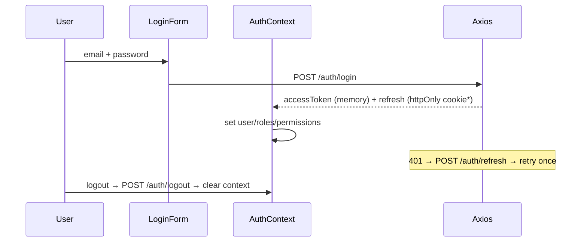
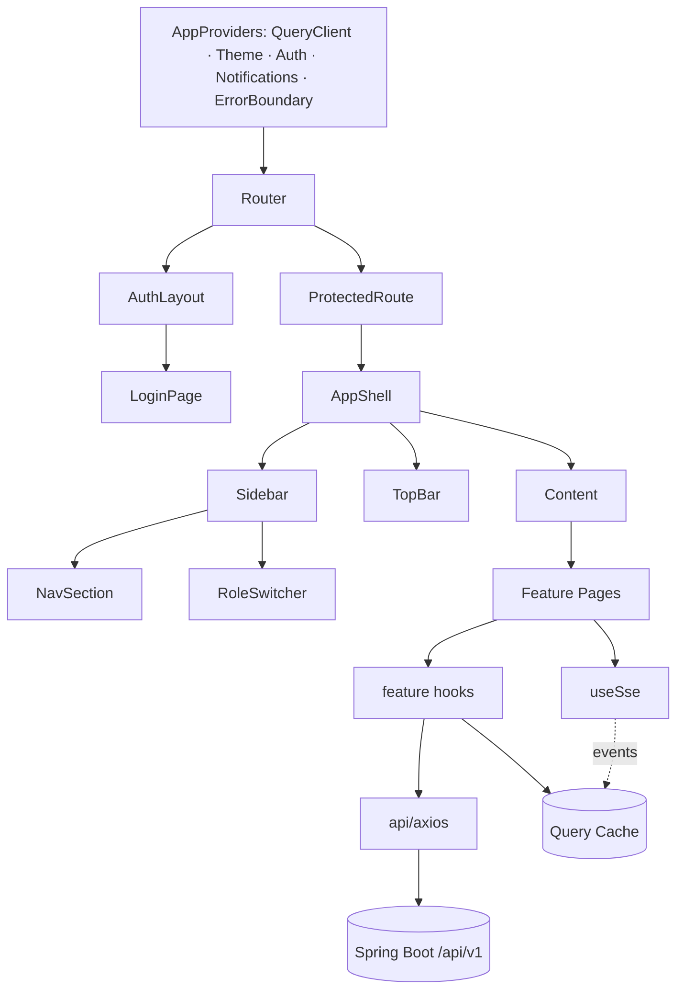
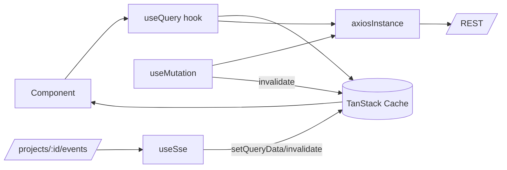

# Protrack — Phase 1 MVP · Frontend Architecture (React 19 + TS + Vite + MUI)

> Status: Design artifact, pre-implementation. No implementation code.
> React 19 · TypeScript · Vite · Material UI v6 · TanStack Query · Context API · Axios · React Router.
> Aligns to the approved prototype, backend architecture, database design, and REST API spec.

---

## 1. Principles & tech choices

- **Feature-first structure** — code grouped by business feature (mirrors backend modules), not by technical type, so a feature is understood/changed in one place.
- **Server state vs client state split** — **TanStack Query** owns all server data (cache, polling, invalidation, optimistic updates); **Context API** owns cross-cutting client state (auth, active role, theme); **React Hook Form + Zod** owns transient form state. No global store needed.
- **Typed contract** — TypeScript types mirror the API DTOs (`types/`), shared by services and components; Zod schemas validate forms against the same backend rules (e.g. ISBN pattern, title length).
- **Thin components, logic in hooks** — components render; data/effects live in `useXxx` query/mutation hooks and a per-feature `api` module.
- **Design-system-driven** — one MUI theme from the approved tokens; reusable primitives map 1:1 to the prototype's components.

---

## 2. Folder structure

```
src/
├── main.tsx
├── App.tsx                              // <AppProviders><RouterProvider/></AppProviders>
│
├── app/
│   ├── providers/AppProviders.tsx       // QueryClient, Theme, Auth, Notifications, ErrorBoundary
│   ├── router/
│   │   ├── routes.tsx                    // route tree (lazy pages)
│   │   ├── ProtectedRoute.tsx            // requires auth
│   │   ├── RoleRoute.tsx                 // requires role(s)
│   │   └── paths.ts                      // typed route builders: paths.project(id)
│   └── theme/
│       ├── theme.ts                      // createTheme from tokens
│       ├── palette.ts  typography.ts  components.ts   // overrides (Card, Button, Chip…)
│
├── api/
│   ├── axios.ts                          // instance + interceptors (auth, refresh, error map)
│   ├── queryClient.ts                    // QueryClient defaults (retry, staleTime, onError)
│   ├── sse.ts                            // fetch-event-source helper (Bearer-auth SSE)
│   ├── problem.ts                        // Problem→AppError mapper, field-error extraction
│   └── keys.ts                           // query-key factory
│
├── components/                           // shared, presentational, design-system
│   ├── layout/      AppShell, Sidebar, TopBar, RoleSwitcher, Breadcrumbs, NavSection
│   ├── data/        DataTable, Pagination, KpiCard, StagePipeline, Timeline,
│   │                DonutChart, GaugeChart, BarChart, QualityRing
│   ├── ai/          ConfidenceChip, AiInsightCard, RecommendationCard, ProgressChecklist
│   ├── feedback/    StatusPill, SeverityBadge, EmptyState, ErrorState, LoadingSkeletons,
│   │                ConfirmDialog, Toast (notistack), InlineFieldErrors
│   ├── inputs/      DropzoneUpload, SearchField (⌘K), FormTextField, FormSelect
│   └── common/      PageHeader, SectionCard, StatDelta, Avatar, IconLabel
│
├── features/                             // one folder per business feature
│   ├── auth/        api.ts hooks.ts AuthContext.tsx LoginPage.tsx components/LoginForm
│   ├── dashboard/   api.ts hooks.ts DashboardPage.tsx components/{KpiRow,ActiveProjectsTable,AiInsights,PipelineWeek}
│   ├── projects/    api.ts hooks.ts pages/{ProjectsListPage,CreateProjectWizardPage,WorkspacePage,CompletedPage}
│   │                components/{ProjectTable,StageCell,wizard/*,workspace-tabs/*}
│   ├── manuscripts/ api.ts hooks.ts UploadManuscriptPage.tsx
│   ├── analysis/    api.ts hooks.ts AnalysisPage.tsx components/{MetricCards,CompositionDonut,Headings,ComplexityGauge,SuggestedTeam,Risks}
│   ├── package/     api.ts hooks.ts ProductionPackagePage.tsx
│   ├── production/  api.ts hooks.ts InProductionPage.tsx UploadPdfPage.tsx
│   ├── preflight/   api.ts hooks.ts PreflightPage.tsx components/PreflightChecklist
│   ├── qa/          api.ts hooks.ts QaSignoffPage.tsx components/{QualityHeader,IssuesTable,IssueDecision}
│   ├── comments/    api.ts hooks.ts CommentsTab.tsx
│   ├── assistant/   api.ts hooks.ts AssistantPanel.tsx
│   ├── notifications/ api.ts hooks.ts NotificationsPanel.tsx useUnreadCount.ts
│   ├── tasks/       api.ts hooks.ts MyTasksPage.tsx
│   ├── reports/     api.ts hooks.ts ReportsPage.tsx
│   └── admin/       users/ roles/ audit/  (pages + tables)
│
├── hooks/           useSse, usePagination, useDebounce, useConfirm, useDownload
├── contexts/        ThemeModeContext  (Auth lives in features/auth)
├── lib/             permissions.ts, navConfig.ts, formatters.ts, constants.ts, fileRules.ts
├── types/           domain.ts (Project, AnalysisResult, QaIssue…), api.ts (Page<T>, Problem)
├── config/          env.ts (typed import.meta.env)
└── assets/
```

---

## 3. Routing & protected routes

React Router (data router). Pages **lazy-loaded** (`React.lazy` + Suspense) for code-splitting.

```
<AuthLayout>                     // centered, no shell
  /login

<ProtectedRoute><AppLayout>      // shell: sidebar + topbar
  /                              → redirect /dashboard
  /dashboard
  /projects
  /projects/new                  (RoleRoute: PM)
  /projects/:id                  → WorkspacePage (tabs: overview|files|comments|versions|activity|assistant)
  /projects/:id/upload           (RoleRoute: PM)         // manuscript
  /projects/:id/analysis
  /projects/:id/package          (RoleRoute: DESIGNER,PM)
  /projects/:id/production       (RoleRoute: DESIGNER)
  /projects/:id/upload-pdf       (RoleRoute: DESIGNER)
  /projects/:id/preflight
  /projects/:id/qa               (RoleRoute: QA,PM)
  /tasks                         (RoleRoute: DESIGNER)
  /review-queue                  (RoleRoute: PM)
  /qa-queue /pdf-reviews         (RoleRoute: QA)
  /reports
  /admin/users /admin/audit      (RoleRoute: ADMIN)
  *                              → NotFound
```
- **`ProtectedRoute`** — reads `AuthContext`; unauthenticated → redirect `/login?from=…`.
- **`RoleRoute`** — checks the active role/permissions; unauthorized → 403 page (not a redirect loop).
- The stage screens (`/analysis`, `/preflight`, `/qa`, …) are **stage-views of one project**; the route resolves the project + its current stage and renders the matching page; the workspace pipeline header links across them.

---

## 4. Layouts & navigation

- **`AppShell`** = fixed **248px `Sidebar`** + **60px `TopBar`** + scrollable content (matches design system).
- **`Sidebar`** renders **role-shaped nav** from `lib/navConfig.ts` keyed by role, in `WORKSPACE` / `INTELLIGENCE` groups, with badge counts (Review queue, My tasks, QA queue) pulled from queries. The **`RoleSwitcher`** ("VIEWING AS") sits pinned at the bottom.
- **`TopBar`** = `Breadcrumbs` · `SearchField` (⌘K command palette) · "+ New project" · notifications bell (`useUnreadCount`) · user avatar menu.
- Nav config example: `PM → [Dashboard, Projects, Review queue, Team]`, `DESIGNER → [Dashboard, My tasks, Projects, Production]`, `QA → [Dashboard, QA queue, PDF reviews, Projects]`, `ADMIN → [Dashboard, Projects, Users & roles, Audit log]` (+ shared Intelligence: AI Assistant, Reports).

---

## 5. Reusable components (→ prototype/design-system)

| Component | Used by | Notes |
|---|---|---|
| KpiCard / StatDelta | Dashboard, Reports | big number + delta badge |
| DataTable + Pagination | Projects, Issues, Users, Audit | server-driven sort/filter/page |
| StagePipeline | Workspace header | check/active/upcoming nodes |
| Timeline | Workspace, Completed | workflow timeline |
| DonutChart / GaugeChart / BarChart | Analysis, Reports | Recharts |
| QualityRing | QA sign-off | score 0–100 |
| ConfidenceChip | Analysis, recommendations | violet AI accent |
| SeverityBadge / StatusPill | Issues, projects | High/Med/Low, stage status |
| AiInsightCard / RecommendationCard | Dashboard, Workspace | confidence + action button |
| ProgressChecklist | Analysis, Preflight | animated Scanning→Pass/Review (SSE-driven) |
| DropzoneUpload | Manuscript, PDF upload | progress + validation |
| NotificationsPanel | TopBar | feed + mark-read |
| SearchField | TopBar | ⌘K palette |
| EmptyState / ErrorState / LoadingSkeletons / ConfirmDialog | everywhere | consistent UX |

---

## 6. Pages & responsibilities (selected)

- **LoginPage** — split brand panel + `LoginForm` (RHF+Zod), SSO button (disabled/Phase 2), demo-prefill.
- **DashboardPage** — role-aware; composes KpiRow, ActiveProjectsTable, AiInsights, PipelineWeek from `useDashboard()`.
- **CreateProjectWizardPage** — 3 steps (Details / Format & specs / Team & review) via a wizard state machine + RHF; submits `useCreateProject()`; on success routes to manuscript upload.
- **WorkspacePage** — `StagePipeline` header + 6 tabs (Overview/Files/Comments/Versions/Activity/Assistant); each tab a lazy sub-component with its own query.
- **AnalysisPage** — subscribes to SSE while job RUNNING (animated ProgressChecklist), then renders MetricCards, CompositionDonut, Headings, ComplexityGauge, SuggestedTeam, Risks from `useAnalysis()`.
- **PreflightPage** — SSE-driven checklist → results + issues; "Send to QA".
- **QaSignoffPage** — QualityRing, severity stats, `IssuesTable` with per-row decision (accept/send-back/comment), bulk triage, "Approve & e-sign".
- **ProductionPackagePage / InProductionPage / UploadPdfPage** — designer flow.
- **ReportsPage**, **Admin Users/Audit pages**, **MyTasksPage**.

---

## 7. State management

**TanStack Query (server state)**
- Query-key factory in `api/keys.ts`: `keys.projects.list(filters)`, `keys.project(id)`, `keys.analysis(id)`, `keys.issues(id)`, `keys.notifications()`.
- `staleTime` tuned per resource (reference data long; dashboards short). Mutations **invalidate** affected keys; **optimistic updates** for issue decisions and notification read.
- **Polling fallback** for AI jobs: while `aiJob.status === RUNNING`, `refetchInterval` on `useAiJob(jobId)` until SSE delivers completion (belt-and-suspenders for SSE buffering, architecture R8).

**Context API (client state)**
- **`AuthContext`** — `user, roles, permissions, accessToken(in memory), login(), logout(), isAuthenticated`.
- **`ThemeModeContext`** — light now, dark-ready.
- **Active-role / "Viewing as"** — a client-only role override (per approved decision: demo toggle, not real impersonation) that reshapes nav; clearly isolated so it never affects server authorization.
- **Notifications unread count** — a small query hook, not context.

**Forms** — React Hook Form + Zod resolver; Zod schemas live beside each feature and encode the same constraints as the backend validators; server `fieldErrors[]` map back onto form fields.

---

## 8. API integration (Axios)

- **`api/axios.ts`** — single instance, `baseURL = env.API_URL + '/api/v1'`, JSON defaults.
  - **Request interceptor:** attach `Authorization: Bearer <accessToken>` from AuthContext store.
  - **Response interceptor:** on `401` → attempt **one** silent refresh (`/auth/refresh`), retry original; on refresh failure → `logout()` + redirect login. Map any error body (Problem) → typed `AppError` (status, code, detail, fieldErrors, traceId).
- **Per-feature `api.ts`** — typed functions (`projectsApi.list(params): Promise<Page<Project>>`); never call axios from components.
- **Hooks** — `useProjects`, `useProject`, `useCreateProject`, etc., wrapping query/mutation with keys + invalidation. Components consume hooks only.
- **Downloads** (package/CSV) — `useDownload` streams via blob/`Location` redirect with auth.

---

## 9. Authentication flow (JWT)


- **Token storage (recommended):** access token **in memory** (AuthContext); refresh token in an **httpOnly, Secure cookie** set by the backend (XSS-safe). *Fallback if cookies aren't used:* refresh in `localStorage` with documented XSS tradeoff. (Decision flagged in §16.)
- **App bootstrap:** on load, attempt silent refresh; success → restore session, failure → login.
- **Route guarding** via `ProtectedRoute` reading `isAuthenticated`; role gating via `RoleRoute` + `useCan()`.

---

## 10. Role-based UI

- **`lib/navConfig.ts`** — nav per role (drives Sidebar).
- **`lib/permissions.ts`** + **`useCan(permission)`** hook + **`<Can permission>`** wrapper — hide/disable actions (e.g. only PM sees "Analyze with AI", only QA sees "Approve & e-sign"). UI gating mirrors backend RBAC; the server remains the source of truth (UI gating is UX, not security).
- **`RoleRoute`** guards whole pages; unauthorized → 403 page.
- The role-shaped surface is computed from `/me` (roles+permissions+nav model), so the UI and backend never drift.

---

## 11. File upload architecture

- **`DropzoneUpload`** (react-dropzone) — client validation from `lib/fileRules.ts`: manuscript `DOCX|PDF`; production PDF `application/pdf` ≤ 500 MB. Reject → inline error.
- **Phase 1:** `multipart/form-data` POST with axios `onUploadProgress` → live progress bar + file card → success check; then triggers the next action (Analyze / Run preflight).
- **Large files & future:** `/uploads:init` presigned path is designed-for; the component abstracts the transport (`uploadStrategy`) so switching to **direct-to-S3 multipart/resumable** later is a strategy swap, not a UI change.
- Upload state is local to the component; on success it invalidates `documents`/`versions` queries.

---

## 12. SSE integration (AI job progress)

- **`useSse(projectId)`** hook built on **`@microsoft/fetch-event-source`** (so it can send the `Authorization: Bearer` header — native `EventSource` cannot). Connects to `GET /api/v1/projects/:id/events`.
- **Events** → cache updates: `job.progress` → `setQueryData(keys.aiJob(id))`; `analysis.completed` → invalidate `keys.analysis(id)`; `preflight.completed` → invalidate `keys.preflight(id)`; `stage.changed` → invalidate `keys.project(id)` + timeline.
- **Lifecycle:** subscribe on entering Analysis/Preflight/Workspace; auto-reconnect with backoff; **fallback to query polling** if the stream errors (handles Render proxy buffering, R8).
- Drives the animated `ProgressChecklist` (Scanning… → Pass/Review) exactly like the prototype, but from real events.

---

## 13. Error handling & loading states

- **Boundaries:** a route-level `ErrorBoundary` (react-error-boundary) renders `ErrorState` with retry; `QueryCache.onError` surfaces toasts (notistack).
- **HTTP errors:** 401 → interceptor refresh/logout; 403 → 403 page/inline; 409 (invalid transition / duplicate) → contextual toast; 422 → `fieldErrors[]` mapped onto form fields via RHF `setError`.
- **Loading:** MUI **Skeletons** per component (cards/tables/charts), button `loading` states on mutations, optimistic UI for fast actions, `EmptyState` for no-data.
- **AI failures:** job `FAILED` → inline retry affordance, never a dead end.

---

## 14. Theme, responsiveness, accessibility

- **Theme** (`app/theme`): MUI `createTheme` from tokens — palette (primary `#0B63CE`, AI `#6D5EF0`, success `#1F9D57`, warning `#C9821A`, danger `#D24545`, ink `#161A1F`, canvas `#F7F8FA`, surface `#FFFFFF`, divider `#E9EBEF`), **Inter** typography scale (Display/Heading/Subhead/Body/Caption + mono for IDs), `shape.borderRadius: 12`, component overrides (Card hairline border + no heavy elevation, Chip tints, Button radius). Light mode now, dark-mode-ready via `ThemeModeContext`.
- **Responsiveness:** desktop-first (prototype is desktop), but breakpoints defined: sidebar collapses to a temporary `Drawer` < `md`; DataTables scroll horizontally; content max-width ~1080–1180px centered.
- **Accessibility:** semantic landmarks, MUI a11y defaults, keyboard nav + visible focus, ARIA labels on icon buttons/charts, AA color contrast (tokens chosen for it), `prefers-reduced-motion` disables the progress animations, the ⌘K palette and role switcher fully keyboard-operable, form labels/`aria-describedby` wired to field errors.

---

## 15. Component diagrams

### 15.1 App composition


### 15.2 Data flow (read + realtime)


---

## 16. Screen → Page → Components → APIs → Backend modules

| Prototype screen | Route / Page | Key components | APIs | Backend module |
|---|---|---|---|---|
| Login | `/login` LoginPage | LoginForm | `POST /auth/login`, `GET /me` | identity |
| Dashboard | `/dashboard` DashboardPage | KpiRow, ActiveProjectsTable, AiInsights, PipelineWeek | `GET /dashboard`, `GET /projects` | project |
| Create project | `/projects/new` Wizard | wizard steps, FormFields | `POST /projects`, `GET /imprints`, `GET /users` | project, identity |
| Upload manuscript | `/projects/:id/upload` | DropzoneUpload | `POST /projects/:id/manuscript` | files |
| AI analysis | `/projects/:id/analysis` AnalysisPage | ProgressChecklist, MetricCards, Donut, Gauge, SuggestedTeam, Risks | `POST/GET /projects/:id/analysis`, SSE, `GET /ai-jobs/:id` | ai, analysis |
| Workspace | `/projects/:id` WorkspacePage | StagePipeline, tabs, RecommendationCard, Timeline | `GET /projects/:id/workspace`, `/timeline`, `/documents`, `/comments`, `/recommendations`, `/activity` | project, files, qa, ai, audit |
| Production package | `/projects/:id/package` | package list, DownloadButton | `GET/POST /projects/:id/package`, `/download` | packaging, files |
| In production | `/projects/:id/production` | status checklist | `GET /projects/:id/workspace`, `POST /transitions` | workflow |
| Upload PDF | `/projects/:id/upload-pdf` | DropzoneUpload | `POST /projects/:id/pdf` | files, workflow |
| AI PDF review | `/projects/:id/preflight` PreflightPage | PreflightChecklist | `POST/GET /projects/:id/preflight`, SSE | ai, preflight |
| QA sign-off | `/projects/:id/qa` QaSignoffPage | QualityRing, IssuesTable, IssueDecision | `GET /projects/:id/issues`, `POST /issues/:id/decision`, `:bulk-decision`, `POST /signoff` | qa |
| Completed | `/projects/:id` (COMPLETED) | Timeline, deliverables | `GET /workspace`, `/timeline`, `/signoffs`, `/package/download` | project, qa, packaging |
| Reports | `/reports` ReportsPage | BarChart, KpiCard, imprint bars | `GET /reports/overview`, `/throughput`, `/workload-by-imprint` | reporting |
| Admin · Users | `/admin/users` | DataTable, user dialogs | `GET/POST/PATCH/DELETE /users`, `/roles` | identity |
| Admin · Audit | `/admin/audit` | DataTable, CSV export | `GET /audit-events`, `:export` | audit |
| Notifications | TopBar NotificationsPanel | NotificationsPanel | `GET /notifications`, `:read-all`, `unread-count` | notification |
| AI Assistant | Workspace tab AssistantPanel | chat, suggested prompts | `GET /assistant/thread`, `POST /assistant/messages` | assistant, ai |

Every screen maps to pages/components, every page to typed API hooks, every API to a backend module — full alignment.

---

## 17. Modularity, scalability, reusability

- **Modularity:** feature folders mirror backend modules; shared primitives in `components/` are presentational and dependency-free; features depend on `api`/`hooks`/`types`, not on each other.
- **Scalability:** route-level code-splitting (lazy pages) keeps initial bundle small; query cache + SSE minimize over-fetching; the upload transport and SSE both sit behind abstractions ready for S3/queue scaling.
- **Reusability:** one design-system layer (theme + primitives) means new screens compose existing parts; query-key factory + per-feature api/hooks give a uniform data pattern.
- **Alignment:** types and Zod schemas track the API contract; the `/me` nav/permission model keeps role-shaped UI in lockstep with backend RBAC, so frontend and backend cannot silently drift.

**Open decisions to confirm (§9/§12):** (1) refresh-token storage — **httpOnly cookie (recommended)** vs body+localStorage; (2) SSE library — **@microsoft/fetch-event-source (recommended)** to allow Bearer auth vs token-in-query EventSource. Both have a default chosen; confirm or override.

No blocking concerns — the frontend architecture is modular, reusable, scalable, and fully aligned with the backend, schema, and API contract.
```
